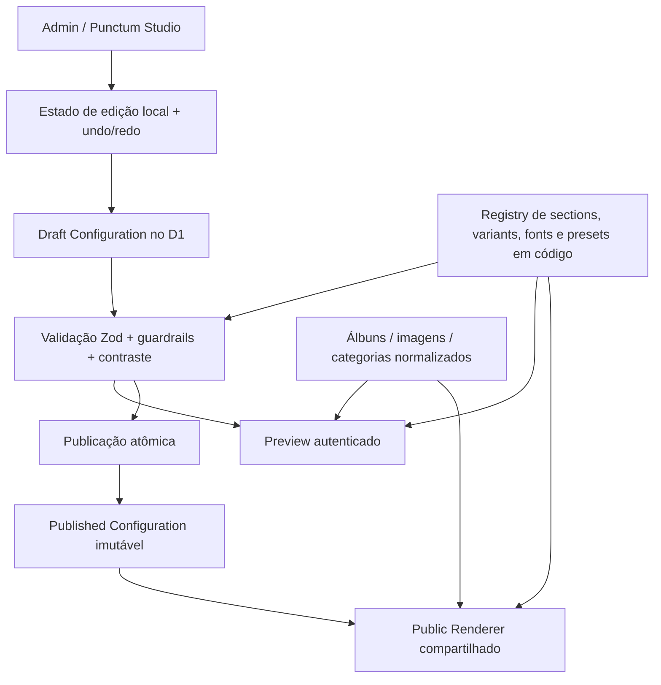

# Auditoria de customização do Punctum Picture

Data da auditoria: 22 de agosto de 2026  
Escopo: repositório local atual, sem consulta ou alteração de infraestrutura remota  
Natureza: auditoria técnica; nenhuma recomendação deste documento foi implementada

## 1. Executive Summary

O Punctum Picture é hoje um aplicativo monolítico enxuto, coerente com a intenção original de entregar site público, painel, API e processamento de mídia em um único Cloudflare Worker. O núcleo técnico é Next.js 16/React 19 executado por vinext/Vite, Cloudflare D1 para metadados, R2 para originais, Cloudflare Images para transformações e um Worker que também aplica autenticação, validação, rate limit, SEO e jobs agendados. Os principais pontos de entrada estão em `app/`, `worker/index.ts`, `worker/api/`, `db/schema.ts` e `wrangler.jsonc`.

O sistema já é forte na administração do portfólio: Maria pode criar ensaios, editar seus dados, vincular categorias, enviar imagens, reordenar fotos, escolher capa, editar alt text, destacar, publicar e arquivar. Isso está implementado em `app/admin/components/AlbumEditor.tsx`, `app/admin/components/AlbumsManager.tsx`, `app/admin/components/CategoriesManager.tsx`, `worker/api/admin.ts`, `worker/utils/validation.ts` e `db/schema.ts`.

A customização estética/editorial, porém, ainda é majoritariamente código. A maior parte dos textos públicos está embutida em `app/page.tsx`, `app/portfolio/page.tsx`, `app/arquivo/page.tsx`, `app/contato/page.tsx`, `app/components/SiteChrome.tsx` e `app/components/LiveAlbum.tsx`. Cores, tipografia, dimensões, breakpoints e layouts estão concentrados em um único stylesheet de 3.110 linhas, `app/globals.css`, com 75 cores hexadecimais distintas, apenas 17 propriedades CSS customizadas e várias camadas de sobrescrita. As fontes são fixas em `app/layout.tsx`.

Existe uma abstração inicial de configurações em `site_settings`, definida em `db/schema.ts` e exposta por `worker/api/public.ts` e `worker/api/admin.ts`. Entretanto, quase todos esses valores estão desconectados do renderer público. Atualmente, apenas WhatsApp é efetivamente lido pelo frontend, em `app/components/WhatsAppLink.tsx`. Tagline, sobre, contato, Instagram e SEO podem ser gravados pelo painel, mas não governam as páginas públicas. `brand_name` sequer pode ser salvo pelo formulário atual. Portanto, essa abstração é parcial, não uma camada de customização funcional.

Também há duas fontes de verdade para o portfólio: dados estáticos em `app/lib/portfolio.ts` e dados dinâmicos no D1. Componentes como `app/components/PortfolioGrid.tsx`, `app/components/FeaturedStories.tsx`, `app/components/ArchiveGrid.tsx` e `app/components/LiveAlbum.tsx` começam com conteúdo estático e sobrepõem dados da API depois da hidratação. Isso oferece fallback, mas cria risco de conteúdo arquivado continuar visível, metadados SSR divergirem do D1 e álbuns novos terem SEO genérico.

### Resposta à questão central

A arquitetura mínima para dar grande liberdade criativa à Maria sem virar um page builder é:

1. um `SiteConfig` tipado e versionado, persistido como snapshots JSON validados no D1;
2. ponteiros separados para configuração `draft` e `published`;
3. um contrato pequeno de design tokens traduzido para CSS variables;
4. um catálogo fechado de sections e variants implementadas/testadas em React;
5. um único renderer público usado tanto pelo site quanto pelo preview autenticado;
6. um editor no admin que manipula apenas enums, ranges, referências de conteúdo e blocos semânticos;
7. validação Zod no cliente e novamente no Worker antes de salvar/publicar;
8. publicação atômica de um snapshot imutável, com histórico e rollback.

O limite ótimo neste repositório é permitir: editar todos os textos editoriais; escolher palettes e pares tipográficos seguros; controlar densidade, largura, tratamento de imagem e intensidade de animação; ativar, desativar e reordenar sections aprovadas; escolher variants predefinidas; selecionar conteúdos/álbuns por referência. O sistema deve parar antes de permitir DOM arbitrário, HTML/CSS/JavaScript, nesting livre, coordenadas, resize pixel a pixel, breakpoints editáveis ou criação de tipos de componente pelo usuário.

O Punctum Studio é viável, mas é uma expansão relevante de produto (`SCOPE EXPANSION`). Ele deve ser construído sobre uma consolidação prévia das fontes de verdade e da camada de estilos. Implementá-lo diretamente sobre o estado atual multiplicaria inconsistências.

## 2. Estado atual da arquitetura

### 2.1 Stack e runtime

| Área | Estado implementado | Arquivos |
| --- | --- | --- |
| Framework | Next.js `16.2.10`, React `19.2.6`, App Router | `package.json`, `app/layout.tsx` |
| Runtime | Cloudflare Worker único | `worker/index.ts`, `wrangler.jsonc` |
| Adaptação SSR/build | vinext `0.0.50`, Vite `8.1.5` | `package.json`, `vite.config.ts` |
| Integração Cloudflare | `@cloudflare/vite-plugin`, bindings Worker | `vite.config.ts`, `wrangler.jsonc`, `worker-configuration.d.ts` |
| Banco | Cloudflare D1/SQLite | `db/schema.ts`, `migrations/`, `drizzle/` |
| ORM/schema | Drizzle ORM; APIs usam SQL preparado diretamente | `db/schema.ts`, `db/index.ts`, `worker/api/*.ts` |
| Imagens | Originais em R2; transformações via Cloudflare Images | `worker/media/serve.ts`, `worker/media/presets.ts` |
| Autenticação | Sessão própria por senha **ou** JWT Cloudflare Access | `worker/api/admin-auth.ts`, `worker/utils/auth.ts` |
| Validação | Zod com objetos strict | `worker/utils/validation.ts` |
| Drag-and-drop | `@dnd-kit` já usado na ordem das fotos | `app/admin/components/AlbumEditor.tsx`, `package.json` |
| Estilos | CSS global, sem Tailwind e sem CSS Modules | `app/globals.css`, `docs/decisions.md` |
| Fontes | Cormorant Garamond + Manrope via `next/font/google` | `app/layout.tsx` |
| Ícones | Lucide React + SVG de WhatsApp | `package.json`, `public/icons8-whatsapp.svg` |
| Testes | Vitest + Workers pool/Miniflare | `vitest.config.ts`, `tests/` |

### 2.2 Fluxo de request

`worker/index.ts` intercepta otimização de imagens, APIs públicas, login admin, APIs administrativas, mídia, sitemap e robots. O restante é encaminhado ao handler do vinext. Respostas recebem headers de segurança por `worker/utils/response.ts`.

### 2.3 Persistência atual

- D1: `site_settings`, `categories`, `albums`, `album_categories`, `images`, `upload_intents`, `inquiries`, `audit_log`, `rate_limit_buckets`, `backup_runs` e `admin_credentials`, conforme `db/schema.ts`.
- R2 `ORIGINALS`: originais privados, conforme `wrangler.jsonc` e `worker/api/admin.ts`.
- R2 `BACKUPS`: snapshots lógicos, conforme `wrangler.jsonc` e `worker/scheduled.ts`.
- Assets locais: 113 JPGs em `public/photos/`, uma logo em `public/logo-punctum.png` e um ícone em `public/icons8-whatsapp.svg`.

### 2.4 Rotas

| Superfície | Rotas | Implementação |
| --- | --- | --- |
| Público | `/`, `/portfolio`, `/arquivo`, `/contato`, `/ensaios/[slug]` | `app/page.tsx`, `app/portfolio/page.tsx`, `app/arquivo/page.tsx`, `app/contato/page.tsx`, `app/ensaios/[slug]/page.tsx` |
| Login | `/acesso` | `app/acesso/page.tsx`, `app/acesso/LoginForm.tsx` |
| Admin | `/admin`, `/admin/ensaios`, `/admin/ensaios/[id]`, `/admin/categorias`, `/admin/contatos`, `/admin/configuracoes` | `app/admin/` |
| API pública | `/api/health`, `/api/public/site`, `/categories`, `/stats`, `/archive`, `/albums`, `/inquiries` | `worker/api/public.ts` |
| API admin | `/admin/api/session`, `/albums`, `/images`, `/uploads`, `/categories`, `/settings`, `/inquiries` | `worker/api/admin-auth.ts`, `worker/api/admin.ts` |
| Mídia/SEO | `/media/:imageId/:preset`, `/sitemap.xml`, `/robots.txt` | `worker/media/serve.ts`, `worker/seo.ts` |

## 3. Inventário técnico

### 3.1 Frontend público

- Home monolítica com hero, manifesto visual, carrossel, histórias, sobre e contato: `app/page.tsx`.
- Portfólio com hero, filtros e grid: `app/portfolio/page.tsx`, `app/components/PortfolioGrid.tsx`.
- Arquivo com masonry CSS, filtros e lightbox: `app/arquivo/page.tsx`, `app/components/ArchiveGrid.tsx`.
- Página de ensaio com hero e composição editorial fixa de seis frames cíclicos: `app/ensaios/[slug]/page.tsx`, `app/components/LiveAlbum.tsx`, `app/globals.css`.
- Contato: `app/contato/page.tsx`, `app/components/ContactForm.tsx`.
- Header/footer/WhatsApp: `app/components/SiteChrome.tsx`, `app/components/WhatsAppLink.tsx`.
- Fallback editorial/portfolio: `app/lib/portfolio.ts`.

### 3.2 Painel administrativo

- Shell responsivo e navegação mobile: `app/admin/components/AdminShell.tsx`, `app/globals.css`.
- Métricas: `app/admin/components/AdminDashboard.tsx`.
- CRUD de ensaios: `app/admin/components/AlbumsManager.tsx`, `app/admin/components/AlbumEditor.tsx`.
- Categorias: `app/admin/components/CategoriesManager.tsx`.
- Contatos: `app/admin/components/InquiriesManager.tsx`.
- Configurações e senha: `app/admin/components/SettingsManager.tsx`.
- Upload/dropzone/DnD: `app/admin/components/AlbumEditor.tsx`.

### 3.3 API e regras de negócio

- Query pública e formulário: `worker/api/public.ts`.
- CRUD, publicação, upload, categorias e settings: `worker/api/admin.ts`.
- Login, troca de senha e cookie: `worker/api/admin-auth.ts`.
- Publish checklist: `worker/utils/publish.ts`.
- Validação: `worker/utils/validation.ts`.
- Slugs/reorder/auditoria/rate limit: `worker/utils/slug.ts`, `worker/utils/reorder.ts`, `worker/utils/audit.ts`, `worker/utils/rate-limit.ts`.

### 3.4 Cloudflare e operação

- Bindings, domínios, cron e observabilidade: `wrangler.jsonc`.
- Metadados Sites: `.openai/hosting.json`.
- Empacotamento Sites: `build/sites-vite-plugin.ts`.
- CORS R2: `config/r2-cors.json`.
- Backup e limpeza: `worker/scheduled.ts`.
- Ambientes locais: `vite.config.ts`, `.env.example`.

### 3.5 SEO

- Metadata root e Open Graph estáticos: `app/layout.tsx`.
- Metadata de páginas: `app/portfolio/page.tsx`, `app/arquivo/page.tsx`, `app/contato/page.tsx`.
- Metadata de ensaio baseada apenas em fallback estático: `app/ensaios/[slug]/page.tsx`.
- JSON-LD hardcoded: `app/page.tsx`.
- Sitemap/robots: `worker/seo.ts`.

### 3.6 Dependências relevantes

- UI/render: `next`, `react`, `react-dom`, `lucide-react` em `package.json`.
- DnD: `@dnd-kit/core`, `@dnd-kit/sortable`, `@dnd-kit/utilities` em `package.json`.
- Upload: `react-dropzone` em `package.json`.
- Banco: `drizzle-orm`, `drizzle-kit` em `package.json`.
- Segurança/validação: `jose`, `zod` em `package.json`.
- `aws4fetch` está declarado em `package.json`, mas não foi encontrado em uso no código auditado.

## 4. Mapa de customização atual

### 4.1 Já funciona de ponta a ponta

| Capacidade | Situação | Arquivos |
| --- | --- | --- |
| Criar ensaio | Configurável no admin | `app/admin/components/AlbumsManager.tsx`, `worker/api/admin.ts` |
| Título, subtítulo, descrição, local e data | Configurável | `app/admin/components/AlbumEditor.tsx`, `worker/utils/validation.ts` |
| Categorias por ensaio | Configurável | `app/admin/components/AlbumEditor.tsx`, `worker/api/admin.ts` |
| Upload de imagens | Configurável | `app/admin/components/AlbumEditor.tsx`, `worker/api/admin.ts` |
| Ordem das fotos | Configurável com DnD e teclado | `app/admin/components/AlbumEditor.tsx`, `worker/utils/reorder.ts` |
| Capa | Configurável | `app/admin/components/AlbumEditor.tsx`, `worker/api/admin.ts` |
| Alt text | Configurável | `app/admin/components/AlbumEditor.tsx`, `worker/api/admin.ts` |
| Destaque | Campo existe e é salvo | `app/admin/components/AlbumEditor.tsx`, `worker/api/admin.ts` |
| Publicar/arquivar | Configurável | `app/admin/components/AlbumEditor.tsx`, `worker/api/admin.ts` |
| Categorias visíveis | Configurável | `app/admin/components/CategoriesManager.tsx`, `worker/api/admin.ts` |
| WhatsApp | D1 + admin + frontend | `db/schema.ts`, `app/admin/components/SettingsManager.tsx`, `app/components/WhatsAppLink.tsx` |
| Status dos contatos | Configurável | `app/admin/components/InquiriesManager.tsx`, `worker/api/admin.ts` |

### 4.2 Existe no banco/painel, mas não governa o site público

`tagline`, `aboutText`, `instagramUrl`, `contactEmail`, `seoTitle` e `seoDescription` existem em `db/schema.ts`, são validados em `worker/utils/validation.ts`, editados por `app/admin/components/SettingsManager.tsx` e retornados por `worker/api/public.ts`. Porém o site público usa textos e metadata hardcoded em `app/page.tsx`, `app/layout.tsx`, `app/components/SiteChrome.tsx` e outras páginas. Esses campos são, na prática, configurações órfãs.

`brandName` existe em `db/schema.ts` e é retornado pelas APIs, mas não é enviado pelo `save()` de `app/admin/components/SettingsManager.tsx` nem aceito no mapping de `worker/api/admin.ts`.

`seoTitle` e `seoDescription` de álbuns existem em `db/schema.ts` e são enviados pelo `save()` de `app/admin/components/AlbumEditor.tsx`, mas o formulário não contém inputs visíveis para esses campos. A metadata em `app/ensaios/[slug]/page.tsx` não consulta o D1.

`focalX` e `focalY` existem no schema, validação e transformação de imagem em `db/schema.ts`, `worker/utils/validation.ts` e `worker/media/presets.ts`, mas não há UI no editor.

### 4.3 Não configurável hoje

- Logo, favicon, fontes, palette, radius, shadows, spacing e escala tipográfica.
- Textos de hero, seções, navegação, rodapé, contato e labels.
- Ordem/visibilidade/variant das sections.
- Layouts de hero, galeria, álbum, header e footer.
- Intensidade de animação, autoplay do carrossel, tratamento de imagem.
- Serviços do formulário e labels sistêmicos.

Arquivos principais: `app/layout.tsx`, `app/page.tsx`, `app/components/*.tsx`, `app/globals.css`.

## 5. Hardcodes encontrados

Nem todo literal deve virar configuração. A classificação abaixo separa constantes saudáveis de valores conceitualmente editáveis.

| Hardcode | Classificação | Diagnóstico | Arquivos |
| --- | --- | --- | --- |
| 75 cores hex e numerosos `rgba()` | Token visual / possível hardcode indevido | Há tokens iniciais, mas a maioria das cores está fora deles e repetida em overrides | `app/globals.css` |
| 17 CSS custom properties | Token de design | Base útil, porém insuficiente para toda a identidade | `app/globals.css` |
| Cormorant Garamond + Manrope | Configuração visual | Deveria virar par tipográfico allowlisted | `app/layout.tsx` |
| Hero `p001`, manifesto `p061`, portfolio `p054`, contato `p033`, OG `p110` | Configuração editorial | Deveriam referenciar imagens/álbuns administráveis | `app/page.tsx`, `app/portfolio/page.tsx`, `app/contato/page.tsx`, `app/layout.tsx` |
| Logo `/logo-punctum.png` e dimensões/crop | Configuração visual | Logo deveria ser asset selecionável com variantes aprovadas | `app/components/SiteChrome.tsx`, `app/globals.css` |
| Nome Punctum/Maria/Brasil e tagline | Configuração editorial/site | Repetidos fora de `site_settings` | `app/layout.tsx`, `app/page.tsx`, `app/components/SiteChrome.tsx`, `app/admin/components/AdminShell.tsx` |
| Copy completa das páginas | Configuração editorial | Deve migrar para config tipada | `app/page.tsx`, `app/portfolio/page.tsx`, `app/arquivo/page.tsx`, `app/contato/page.tsx`, `app/components/LiveAlbum.tsx` |
| Labels de navegação e rodapé | Configuração editorial controlada | Texto editável; rotas devem permanecer fixas | `app/components/SiteChrome.tsx` |
| Labels/erros de formulário | Texto sistêmico | Deve permanecer em catálogo de mensagens em código, não livre no Studio | `app/components/ContactForm.tsx`, `worker/utils/errors.ts`, `worker/utils/validation.ts` |
| Serviços do formulário | Configuração editorial controlada | Enum administrável ou catálogo versionado | `app/components/ContactForm.tsx` |
| Número/mensagem WhatsApp default | Configuração de usuário com fallback | D1 já sobrepõe; fallback duplicado | `app/components/WhatsAppLink.tsx`, `drizzle/0003_whatsapp_contact.sql`, `migrations/0004_whatsapp_contact.sql` |
| 113 imagens e 13 álbuns estáticos | Conteúdo hardcoded / fallback | Segunda fonte de verdade conflitante com D1 | `app/lib/portfolio.ts`, `drizzle/0001_seed_portfolio.sql` |
| 12 imagens do carrossel | Configuração editorial | Lista estática | `app/lib/portfolio.ts` |
| Layout por `nth-child` e seis frames | Configuração visual/estrutural | Deveria virar variants aprovadas | `app/globals.css`, `app/components/LiveAlbum.tsx` |
| Autoplay de 5.200 ms e deslocamento de 72% | Configuração de feature | Pode virar enum/range seguro | `app/components/PhotoCarousel.tsx` |
| Breakpoints 640/680/900/1050 px | Deve permanecer constante | Parte do contrato responsivo testado | `app/globals.css` |
| Presets `thumb/card/gallery/hero/og` | Deve permanecer constante | Segurança, custo e performance | `worker/media/presets.ts` |
| Limites de upload/rate limit | Configuração técnica | Ambiente/developer, não Studio | `wrangler.jsonc`, `.env.example`, `worker/api/admin.ts` |
| Domínios/origens | Configuração técnica | Infraestrutura validada | `wrangler.jsonc`, `worker/index.ts`, `worker/seo.ts` |
| E-mails admin locais e hash local | Configuração técnica sensível | Não deve ficar como personalização; revisar gestão de segredo | `vite.config.ts`, `.env.example` |
| CSP com `unsafe-inline` | Configuração de segurança | Não expor; revisar antes do Studio | `worker/utils/response.ts` |
| `--line-admin` inexistente | Possível hardcode/defeito | Token usado mas não declarado | `app/globals.css` |
| `.carousel-slide` em vez de `.photo-carousel-slide` | Possível hardcode/defeito | Override de cor não atinge o componente real | `app/globals.css`, `app/components/PhotoCarousel.tsx` |

## 6. Matriz completa de customizações

Classes: A já configurável; B fácil; C estrutural moderada; D avançada; E não recomendada; F fora do escopo arquitetural.

| Customização | Estado atual | Classe | Onde está no código | Mudança necessária | Risco | Observações |
| --- | --- | --- | --- | --- | --- | --- |
| WhatsApp/número/mensagem | Funcional | A | `app/components/WhatsAppLink.tsx`, `site_settings` | Consolidar fallback | Baixo | Única setting pública realmente consumida |
| Álbuns e fotos | Funcional | A | `AlbumEditor.tsx`, `worker/api/admin.ts` | Nenhuma estrutural | Baixo | Preservar modelo normalizado |
| Categorias | Funcional | A | `CategoriesManager.tsx`, `album_categories` | Nenhuma estrutural | Baixo | Ordenação de categorias não está exposta |
| Ordem/capa/alt text | Funcional | A | `AlbumEditor.tsx` | Nenhuma estrutural | Baixo | DnD já acessível por teclado |
| Título/subtítulo/descrição/local/data de ensaio | Funcional | A | `AlbumEditor.tsx`, `albums` | Nenhuma estrutural | Baixo | SEO do álbum não está exposto/renderizado |
| Featured | Persistido | A | `AlbumEditor.tsx`, `albums.featured` | Melhorar UX | Baixo | Controle atual não é visível no formulário auditado; valor é salvo se já existir |
| Tagline/sobre/contato/Instagram/SEO site | Persistido, não renderizado | B | `SettingsManager.tsx`, `site_settings` | Ligar renderer/metadata ao D1 | Médio | Quick win prioritário |
| Nome da marca | Somente leitura | B | `site_settings.brand_name` | Aceitar/editar/consumir | Baixo | Rotas não devem mudar com nome |
| Textos de hero e seções | Hardcoded | B/C | `app/page.tsx` | Config tipada + campos admin | Médio | Antes, extrair renderer |
| Textos de portfolio/arquivo/contato | Hardcoded | B/C | páginas em `app/` | Config tipada | Médio | Separar editorial de interface |
| Navegação/rodapé | Hardcoded | B | `SiteChrome.tsx` | Labels editáveis, rotas fixas | Baixo | Não permitir remover acesso essencial |
| Serviços do formulário | Hardcoded | B | `ContactForm.tsx` | Enum configurável validado | Baixo | Limitar quantidade e tamanho |
| Logo | Asset fixo | C | `SiteChrome.tsx`, `public/logo-punctum.png` | Asset reference + upload/preset | Médio | Validar formato/dimensões |
| Favicon | Ausente | B/C | `app/layout.tsx`, `public/` | Asset específico e metadata | Baixo | Não reutilizar original enorme |
| Imagens editoriais globais | Fixas | C | páginas públicas | Referências a image/album IDs | Médio | Resolver fallback e publicação |
| Palette pronta | Inexistente | C | `app/globals.css` | ThemeConfig + CSS variables | Médio | Presets recomendados |
| Palette personalizada | Inexistente | C/D | `app/globals.css` | Color schema + contraste | Médio/alto | Bloquear publish ilegível |
| Família de títulos/corpo | Fixa | C | `app/layout.tsx` | Font registry allowlisted | Médio | Evitar URL arbitrária |
| Escala/peso/tracking/line-height | Fixos | C | `app/globals.css` | Enums/ranges tokenizados | Médio | Não expor valor CSS livre |
| Radius/sombra/superfície | Fixos | B/C | `app/globals.css` | Tokens semânticos | Baixo/médio | Poucas opções coerentes |
| Spacing/container | Fixos | C | `app/globals.css` | Escalas/presets | Médio | Global + override limitado por section |
| Intensidade de animação | Fixa | B/C | `globals.css`, `PhotoCarousel.tsx` | Enum `none/subtle/expressive` | Baixo | Sempre respeitar reduced motion |
| Tratamento de imagem | Fixo | C | `globals.css` | Enums para saturation/contrast/overlay | Médio | Não substituir transform server |
| Hero variants | Um layout | C | `app/page.tsx`, `globals.css` | Componente + registry | Médio | 2–4 variants testadas |
| Featured work variants | Um grid | C | `FeaturedStories.tsx`, `globals.css` | Variants de composição | Médio | Reutilizar seleção de álbuns |
| Galeria/álbum variants | Um padrão de seis frames | C/D | `LiveAlbum.tsx`, `globals.css` | Registry de gallery layouts | Alto | Impacta imagem, CLS e mobile |
| Archive layout | CSS columns fixo | C | `ArchiveGrid.tsx`, `globals.css` | Presets grid/masonry | Médio | Limitar densidade/proporção |
| Header variants | Um | C | `SiteChrome.tsx` | 2–3 variants | Médio | Navegação e acessibilidade fixas |
| Footer variants | Um | C | `SiteChrome.tsx` | 2–3 variants | Baixo/médio | Conteúdo essencial obrigatório |
| Ativar/desativar sections | Inexistente | C | `app/page.tsx` | PageConfig + registry | Médio | Definir sections obrigatórias |
| Reordenar sections | Inexistente | C/D | `app/page.tsx` | DnD semântico + order | Médio/alto | `dnd-kit` já existe |
| Duplicar section | Inexistente | D | Novo registry | Regras de cardinalidade/IDs | Alto | Só para tipos explicitamente duplicáveis |
| Background por section | Hardcoded | C | `globals.css` | Surface enum/palette slot | Médio | Não aceitar CSS/color sem contraste |
| Alinhamento/largura/densidade | Hardcoded | C | `globals.css` | Enums por type | Médio | Settings dependem do schema da section |
| Quantidade de itens | Parcial via query fixa | B/C | `FeaturedStories.tsx`, APIs | Range validado | Baixo | Ex.: 3–8, não ilimitado |
| Filtros on/off | Fixos | B/C | `PortfolioGrid.tsx`, `ArchiveGrid.tsx` | Feature flag | Baixo | Manter quando categorias excedem limite |
| Lightbox on/off/variant | Fixo | C | `ArchiveGrid.tsx` | Feature flag/variant | Médio | Acessibilidade precisa de correções |
| Autoplay carrossel | Fixo | B | `PhotoCarousel.tsx` | Toggle + intervalo limitado | Baixo | Default off ou sutil |
| Preview ao vivo | Ausente | D | Novo Studio/renderer | Draft + iframe/renderer comum | Alto | Principal módulo novo |
| Draft/publish config | Ausente | D | Novo schema/API | Snapshots/pointers | Alto | Necessário antes de editor visual |
| Histórico/rollback | Auditoria genérica apenas | D | `audit_log` | Versões imutáveis | Médio/alto | Não usar audit log como snapshot |
| Undo/redo | Ausente | C | Novo Studio state | Reducer local + autosave | Médio | Não precisa persistir cada tecla |
| Presets completos | Ausente | C | ThemeConfig/PageConfig | Dados estáticos versionados | Médio | Superior a temas duplicados |
| Multi-page composition | Páginas fixas | D | todas páginas | PageConfig por página | Alto | Começar somente pela home |
| HTML/CSS/JS arbitrário | Inexistente | E | — | Não implementar | Crítico | Quebra segurança/qualidade |
| Canvas/posicionamento x-y | Inexistente | E | — | Não implementar | Crítico | Vira page builder |
| Plugins de terceiros | Inexistente | F | — | Mudaria arquitetura/produto | Crítico | Fora da visão |
| Multi-tenant/SaaS | Inexistente | F | schema inteiro | Rearquitetura | Crítico | Fora do produto |

## 7. Design Tokens

### O que existe

`app/globals.css` define tokens básicos (`--ink`, `--paper`, `--purple`, `--line`, `--muted`, etc.), mas redefine parte deles dentro de `.site-shell` e ainda usa dezenas de literais. Tipografia, spacing, radius, shadows, containers, animation e image treatment não têm contratos de tokens completos.

### Recomendação

Criar um `ThemeConfig` tipado, sem CSS livre:

```ts
type ThemeConfig = {
  palette: {
    mode: "light" | "dark";
    background: ColorToken;
    foreground: ColorToken;
    primary: ColorToken;
    secondary: ColorToken;
    accent: ColorToken;
    muted: ColorToken;
    surface: ColorToken;
  };
  typography: {
    headingFamily: FontFamilyId;
    bodyFamily: FontFamilyId;
    headingScale: "restrained" | "editorial" | "display";
    bodyScale: "compact" | "comfortable";
    headingWeight: "regular" | "medium" | "semibold";
    headingTracking: "tight" | "normal";
  };
  shape: { radius: "square" | "soft" | "rounded" };
  spacing: { density: "compact" | "balanced" | "spacious" };
  container: { width: "narrow" | "standard" | "wide" };
  shadow: { style: "none" | "soft" | "graphic" };
  motion: { intensity: "none" | "subtle" | "expressive" };
  image: { treatment: "natural" | "soft" | "contrast" | "monochrome" };
};
```

Os valores persistidos devem ser IDs/enums. O renderer resolve esses IDs para CSS variables conhecidas. Cores personalizadas podem ser hex normalizado, mas devem gerar tokens derivados e passar por contraste mínimo antes de publicar. O admin nunca deve enviar nomes de propriedades CSS.

### Onde deve viver

- Definição TypeScript/Zod e defaults: novo módulo compartilhado de configuração, em código.
- Valor editável draft/published: JSON versionado no D1.
- Tradução para estilo: CSS variables no wrapper público.
- Presets e font registry: código versionado.
- Admin: controles semânticos, palette picker e preview.

## 8. Site Settings

### Estado atual

`site_settings` contém nome, tagline, sobre, WhatsApp, Instagram, e-mail e SEO em `db/schema.ts`. A API está em `worker/api/public.ts` e `worker/api/admin.ts`; a UI, em `app/admin/components/SettingsManager.tsx`. Apenas WhatsApp é consumido publicamente por `app/components/WhatsAppLink.tsx`.

### Modelo recomendado

O contato, identidade nominal, SEO e links devem fazer parte do snapshot configurável para que uma publicação seja atômica. Álbuns/imagens/categorias continuam normalizados. Durante a transição, `site_settings` pode permanecer como fonte legada, com migração única para o primeiro `SiteConfig`.

Campos apropriados: brand name, display name, tagline, biography, contact e-mail, WhatsApp, social links allowlisted, default SEO, locale fixo `pt-BR`, footer copy e referências de assets. Domínio, bindings, Access e secrets não pertencem a Site Settings.

## 9. Section Settings

### Estado atual

Sections são JSX estático e ordenado em `app/page.tsx`. Algumas partes já estão componentizadas (`PhotoCarousel`, `FeaturedStories`, `ContactForm`), mas o componente da página ainda controla copy, ordem e composição.

### Modelo recomendado

```ts
type SectionConfig = {
  id: string;
  type: SectionType;
  enabled: boolean;
  variant: string;
  content: Record<string, unknown>;
  settings: Record<string, unknown>;
};
```

Não usar `Record<string, unknown>` sem validação em produção; cada `type` deve formar uma união discriminada Zod com `content` e `settings` próprios. O array define a ordem. IDs são opacos; types e variants vêm de allowlists.

Sections derivadas da home atual:

- `hero`: de `app/page.tsx`.
- `statement`: atual `visual-thesis` em `app/page.tsx`.
- `photo_reel`: atual `PhotoCarousel` em `app/components/PhotoCarousel.tsx`.
- `featured_work`: atual `FeaturedStories` em `app/components/FeaturedStories.tsx`.
- `about`: atual manifesto em `app/page.tsx`.
- `contact`: atual bloco e `ContactForm` em `app/page.tsx`.

`testimonials`, `quote`, `social` e `cta` só devem entrar se houver conteúdo e caso de uso reais; são `SCOPE EXPANSION`, não pressupostos do código atual.

## 10. Feature Settings

### Candidatos administráveis

- Lightbox: enabled/disabled e uma variant aprovada.
- Filtros: enabled/disabled, desde que não prejudique coleções grandes.
- Carrossel: autoplay, intervalo entre limites e intensidade de transição.
- Metadados visuais: mostrar categoria, local, data, número de imagens.
- Gallery behavior: preset de layout e densidade.
- Motion: global + redução obrigatória por `prefers-reduced-motion`.

### Deve permanecer em código

- Lazy loading, `sizes`, prioridades de LCP e transform presets.
- Limites de upload, MIME, rate limit e TTL.
- Sanitização, schema, headers, CSP e auth.
- Breakpoints e regras de acessibilidade.

## 11. Painel administrativo

### O que Maria administra hoje

Ensaios, conteúdo básico de álbum, categorias, uploads, ordem, capa, alt text, destaque persistido, publicação/arquivamento, contatos, WhatsApp e alguns settings. Arquivos: `app/admin/components/*.tsx` e `worker/api/admin.ts`.

### Controles adicionais por complexidade

#### Básico

- Textos editoriais, contato e redes.
- Escolha de imagens editoriais.
- Palette/preset tipográfico.
- Ativar/desativar sections opcionais.
- Reordenar sections verticalmente.
- Escolher variants com miniaturas.
- Selecionar álbuns em destaque.

#### Intermediário

- Palette personalizada com feedback de contraste.
- Escala/densidade/alinhamento/largura por enum.
- Tratamento de imagem e intensidade de motion.
- SEO por página.
- Gallery preset e quantidade de itens.

#### Avançado

- Duplicar sections permitidas.
- Configuração individual de surface/contraste.
- Rollback de versão publicada.
- Curadoria específica por breakpoint apenas como preset, nunca valores livres.

#### Não expor

- CSS/HTML/JS, z-index, position, breakpoints, `sizes`, quality de imagem.
- URLs internas R2, object keys, API routes, domínio e bindings.
- CSP, auth, cookies, rate limit, migrations e secrets.

## 12. Guardrails

1. União discriminada Zod por section e variant.
2. Máximo de sections por página e cardinalidade por type.
3. Sections essenciais não removíveis; podem ter variant minimal.
4. Enums em vez de valores CSS.
5. Ranges pequenos para contagens e intervalos.
6. Fontes em registry local/curado, nunca URL arbitrária.
7. URLs sociais somente `https:` e, quando possível, hosts allowlisted.
8. Assets por IDs internos publicados, não URL fornecida pelo usuário.
9. Contraste validado antes de publicar; preview mostra warnings.
10. Fallback para token, variant ou section desconhecida.
11. `schemaVersion` em todo snapshot.
12. Limites de tamanho/profundidade do JSON.
13. Publicação atômica e snapshots imutáveis.
14. Reset por seção, reset de tema e preset inicial.
15. Autosave com optimistic concurrency (`revision`).
16. Undo/redo local; histórico persistido por snapshots relevantes.
17. Renderer ignora propriedades desconhecidas.
18. Nenhuma execução ou interpolação de CSS/HTML.

## 13. Temas e presets

Presets como Editorial, Fine Art, Minimal, Modern e Dark são viáveis e recomendados como dados iniciais: combinação de tokens, variants e settings. Eles não devem duplicar páginas nem componentes.

Um preset deve compartilhar 100% do renderer e dos schemas. Pode alterar palette, font pair, density, image treatment, motion e variants selecionadas. Depois de aplicado, Maria pode ajustar valores permitidos. O preset é uma operação de inicialização do draft, não uma bifurcação permanente.

“Tema” deixa de ser saudável quando exige markup exclusivo, rotas próprias, regras especiais não representadas pelo registry ou componentes duplicados por preset. Nesse ponto são múltiplos sites mantidos no mesmo repositório, classe D/E.

## 14. Layout dinâmico

### Diferenças conceituais

1. **Configuração de componente:** muda conteúdo/densidade/alinhamento do mesmo componente.
2. **Variante de componente:** escolhe uma implementação aprovada do mesmo papel semântico.
3. **Composição dinâmica:** reordena/ativa blocos aprovados numa página.
4. **Page builder:** cria estrutura/nesting/posicionamento arbitrários.

Recomendação: chegar até composição dinâmica limitada. A home pode ser um array de sections com regras; páginas de portfólio, arquivo e ensaio devem começar com layouts fixos e variants específicas. Header/footer permanecem slots globais com poucas variants.

Reordenação deve ser vertical, operar sobre cards semânticos e persistir ordem por ID. Nada de coordenadas. O `@dnd-kit` já presente em `app/admin/components/AlbumEditor.tsx` atende o problema e oferece Pointer, Touch e Keyboard sensors.

## 15. Performance

### Riscos atuais

- Fetches públicos com `no-store` em `worker/api/public.ts` impedem cache para álbuns, arquivo e estatísticas.
- Dados públicos chegam depois da hidratação em `FeaturedStories.tsx`, `PortfolioGrid.tsx`, `ArchiveGrid.tsx` e `LiveAlbum.tsx`.
- Fallback estático aumenta bundle e duplica conteúdo em `app/lib/portfolio.ts`.
- `app/globals.css` envia toda a camada pública/admin e múltiplos overrides.

### Requisitos da arquitetura proposta

- Studio deve viver em rota/admin chunks separados; nenhum `dnd-kit`, histórico ou editor deve entrar no bundle público por import compartilhado acidental.
- Renderer público recebe um único snapshot publicado validado.
- Resolver config no SSR/Worker e aplicar CSS variables sem fetch pós-hidratação.
- Cachear configuração publicada por revision/ETag no edge; invalidar ao publicar.
- Não executar dezenas de queries: uma leitura de config + queries de conteúdo necessárias.
- Referenciar álbuns/imagens normalizados, sem duplicar payload binário no JSON.
- Carregar apenas o par tipográfico ativo; não importar uma biblioteca inteira de fontes.
- Preservar Image Transformations e `sizes` controlados pelo código.
- Medir LCP/CLS/INP por variant antes de liberá-la no catálogo.

## 16. Segurança

Valores que nunca devem ser aceitos diretamente: HTML, CSS, JavaScript, nomes de classes, style strings, URLs `javascript:`/`data:` externas, object keys R2, nomes de tabela/coluna, query SQL, headers, CSP, origem, domínio e rotas.

Todo config deve ser validado por schema strict em `worker/utils/validation.ts` ou módulo equivalente. Textos React comuns podem ser renderizados como texto escapado; rich text, se um dia necessário, deve usar um modelo estrutural mínimo e sanitização explícita — não HTML armazenado.

O preview em iframe encontra um bloqueador atual: `worker/utils/response.ts` envia `X-Frame-Options: DENY` e CSP `frame-ancestors 'none'` para todas as respostas. Um preview fiel por iframe exigirá exceção restrita a uma rota autenticada de preview, com `frame-ancestors 'self'`, sem relaxar o site público. Alternativa sem iframe é renderizar no mesmo DOM, mas isso reduz fidelidade e aumenta risco de colisão de estilos.

Há uma divergência de autenticação: `docs/panel-flows.md` diz “não há senha própria”, mas `worker/api/admin-auth.ts`, `worker/utils/auth.ts`, `app/acesso/` e `app/admin/components/SettingsManager.tsx` implementam senha e sessão próprias em paralelo ao Access. Antes do Studio, é necessário decidir a fonte de identidade. Preview tokens e permissões dependem disso.

## 17. O que deve continuar fixo

### O QUE DEVE CONTINUAR FIXO

| Item | Motivo | Arquivos atuais |
| --- | --- | --- |
| Semântica HTML, landmarks e ordem de foco | Acessibilidade | componentes em `app/` |
| Breakpoints e regras responsivas internas | Evitar layouts quebrados | `app/globals.css` |
| Presets/quality/fit de transformação | Performance, custo e abuso | `worker/media/presets.ts` |
| Lazy loading, `sizes` e prioridade LCP | Core Web Vitals | componentes de imagem em `app/` |
| API, auth, CSP, cookies e rate limit | Segurança | `worker/` |
| MIME/tamanho/TTL de upload | Segurança/custo | `worker/api/admin.ts`, `wrangler.jsonc` |
| Rotas e slugs técnicos | Links/SEO | `worker/utils/slug.ts`, `app/` |
| Tipos de section e variant disponíveis | Manutenibilidade | futuro section registry |
| Limites de cardinalidade/nesting | Evitar estados inválidos | futuro schema |
| IDs e referências de dados | Integridade | D1 |
| Código de renderização | Evitar page builder/plugin system | futuro renderer |
| Reduced motion e contraste mínimo | Acessibilidade | `app/globals.css`, futuro validator |
| Origem, domínio e bindings | Infraestrutura | `wrangler.jsonc`, `.openai/hosting.json` |

## 18. Quick Wins

Ranking por valor/ esforço:

| Rank | Quick win | Benefício | Dificuldade | Arquivos afetados | Migration | Painel | Risco |
| --- | --- | --- | --- | --- | --- | --- | --- |
| 1 | Conectar `site_settings` existente ao renderer público e metadata | Copy/SEO/contato deixam de depender do developer | Média | `worker/api/public.ts`, `app/layout.tsx`, páginas, `SiteChrome.tsx` | Não, inicialmente | Já existe parcial | Médio |
| 2 | Eliminar D1 + `app/lib/portfolio.ts` como duas fontes públicas | Arquivamento, SEO e conteúdo consistentes | Média | `app/lib/portfolio.ts`, componentes públicos, páginas de ensaio | Não | Não | Médio |
| 3 | Consolidar CSS em tokens semânticos únicos | Base segura para palettes e Studio | Média | `app/globals.css`, `app/layout.tsx` | Não | Não | Baixo/médio |
| 4 | Expor SEO de álbum e focal point já suportados | Aproveita campos existentes | Baixa | `AlbumEditor.tsx`, `app/ensaios/[slug]/page.tsx` | Não | Sim | Baixo |
| 5 | Adicionar preset visual inicial (palette + font pair + density), ainda sem editor visual | Personalidade com pouca superfície | Média | config compartilhada, `globals.css`, `layout.tsx`, settings | Sim, se persistido | Sim | Médio |
| 6 | Extrair sections atuais da home para componentes tipados | Prepara variants sem mudar layout | Média | `app/page.tsx`, novos componentes | Não | Não | Baixo |
| 7 | Reutilizar `dnd-kit` para ordem de sections após registry | Drag-and-drop acessível sem dependência nova | Média | futuro Studio | Sim | Sim | Médio |

## 19. Até onde o Punctum pode ir

### ATÉ ONDE O PUNCTUM PODE IR

#### Pode fazer tranquilamente

- Editar textos, contato, redes e SEO.
- Gerenciar integralmente portfólio e categorias.
- Escolher logo/favicons/imagens editoriais dentro de assets validados.
- Aplicar palettes, font pairs, density e motion presets.
- Escolher variants simples para componentes existentes.

#### Pode fazer com alguma arquitetura adicional

- Punctum Studio com preview fiel.
- Draft/publish/rollback de configuração.
- Reordenação e visibilidade de sections da home.
- Palette personalizada com contraste automático.
- Vários layouts aprovados de hero/galeria/header/footer.
- Histórico e undo/redo.

#### Pode fazer, mas provavelmente não vale a pena

- Composição dinâmica completa em todas as páginas desde a primeira versão.
- Duplicação ilimitada de sections.
- Editor rich text complexo.
- Preview compartilhável externamente por token.
- Controles distintos para cada breakpoint.

#### Não deveria fazer

- CSS/HTML/JavaScript arbitrário.
- Canvas, x/y e resize pixel a pixel.
- Nesting livre de componentes.
- Plugins de UI de terceiros dentro do site.
- Permitir remoção de acessibilidade, navegação ou segurança.

#### Exigiria transformar o produto em outra coisa

- CMS universal/page builder.
- Multi-tenant/SaaS.
- Marketplace de templates/plugins.
- CRM, pagamentos, agenda, contratos e autenticação de clientes.
- Galeria privada/seleção de provas/editor de imagens.

## 20. Roadmap recomendado

### Fase 0 — Corrigir fontes de verdade e divergências

- Objetivo: D1 e renderer público coerentes; escolher modelo de auth/migrations.
- Afeta: `app/lib/portfolio.ts`, componentes públicos, `worker/api/public.ts`, `app/ensaios/[slug]/page.tsx`, `migrations/`, `drizzle/`, auth/docs.
- Migration: possivelmente para alinhar trilhas; não para conteúdo básico.
- Risco: alto se ignorado; médio para corrigir.
- Dependência: decisão sobre deployment path e Access/senha.
- Conclusão: arquivar no admin remove do público/SSR; metadata vem da mesma fonte; uma trilha canônica de migrations.

### Fase 1 — Contrato de configuração e tokens

- Objetivo: `SiteConfig`/`ThemeConfig` tipados, defaults e CSS variables consolidadas.
- Afeta: `app/globals.css`, `app/layout.tsx`, novo módulo compartilhado.
- Migration: sim, para primeira versão do config.
- Risco: médio.
- Dependência: Fase 0.
- Conclusão: página atual renderiza idêntica usando config/defaults validados.

### Fase 2 — Copy e settings efetivos

- Objetivo: remover textos editoriais públicos do JSX.
- Afeta: páginas públicas, `SiteChrome.tsx`, metadata, admin settings.
- Migration: extensão/seed do snapshot.
- Risco: médio.
- Dependência: Fase 1.
- Conclusão: Maria altera toda copy editorial e SEO sem código.

### Fase 3 — Section registry da home

- Objetivo: extrair home em sections tipadas sem liberar reordenação ainda.
- Afeta: `app/page.tsx`, novos section components/registry/schemas.
- Migration: config inicial de composição.
- Risco: médio.
- Dependência: Fase 1/2.
- Conclusão: renderer reproduz a home via array validado.

### Fase 4 — Draft, publish e preview

- Objetivo: snapshots, pointers, preview autenticado e publicação atômica.
- Afeta: D1, APIs admin/public, Worker headers, novo `/admin/studio`.
- Migration: sim.
- Risco: alto.
- Dependência: Fase 3; decisão auth.
- Conclusão: edição não altera público; publish promove snapshot; rollback comprovado.

### Fase 5 — Studio básico

- Objetivo: textos, palette, tipografia, presets e preview desktop/tablet/mobile.
- Afeta: admin, renderer, schema, CSS variables.
- Migration: não além da Fase 4.
- Risco: médio/alto.
- Dependência: Fase 4.
- Conclusão: duas identidades significativamente diferentes usando o mesmo renderer.

### Fase 6 — Composição controlada

- Objetivo: enabled/order/variant/settings por section com DnD.
- Afeta: Studio, registry, schemas.
- Migration: schemaVersion/config migration.
- Risco: alto.
- Dependência: Fase 5.
- Conclusão: reordenação acessível, responsiva e validada; nenhuma liberdade estrutural arbitrária.

### Fase 7 — Variants avançadas e hardening

- Objetivo: galleries/heroes adicionais, a11y/perf matrix, histórico refinado.
- Afeta: components, tests, QA.
- Migration: somente se schema mudar.
- Risco: médio por variant, acumulativo alto.
- Dependência: métricas/uso real do Studio.
- Conclusão: cada variant passa QA mobile, teclado, contraste e Core Web Vitals.

## 21. Dívida técnica / bloqueadores

1. **Duas fontes de verdade de conteúdo:** `app/lib/portfolio.ts` e D1.
2. **Duas trilhas de migration:** `migrations/` e `drizzle/` divergem. `admin_credentials` existe em `drizzle/0002_wonderful_wither.sql`, mas não em `migrations/`; o seed completo do portfólio também está só em `drizzle/0001_seed_portfolio.sql`.
3. **Settings desconectadas:** `site_settings` não governa a maioria do público.
4. **CSS global acumulado:** 3.110 linhas, 75 hex únicos e cascatas repetidas em `app/globals.css`.
5. **SSR/SEO não canônico:** páginas usam fallback estático e atualizam via client fetch.
6. **Auth divergente:** documentação Access-only versus senha própria + Access.
7. **Preview iframe bloqueado:** headers globais DENY/`frame-ancestors 'none'`.
8. **Cache público conservador:** endpoints centrais `no-store`.
9. **Mídia de draft potencialmente acessível por ID:** `worker/media/serve.ts` valida imagem ready/deleted, mas não verifica status publicado do álbum.
10. **Sitemap incompleto:** `/arquivo` não está em `worker/seo.ts`.
11. **CSP permissiva para inline:** `style-src` e `script-src` usam `unsafe-inline` em `worker/utils/response.ts`.
12. **Acessibilidade do lightbox:** `app/components/ArchiveGrid.tsx` trata teclado, mas não implementa focus trap/restauração explícita de foco.
13. **Tokens inexistentes/seletores incorretos:** `--line-admin` e `.carousel-slide` em `app/globals.css`.

## 22. Arquivos relevantes

### Aplicação

- `app/layout.tsx`
- `app/page.tsx`
- `app/globals.css`
- `app/lib/portfolio.ts`
- `app/components/SiteChrome.tsx`
- `app/components/FeaturedStories.tsx`
- `app/components/PortfolioGrid.tsx`
- `app/components/ArchiveGrid.tsx`
- `app/components/LiveAlbum.tsx`
- `app/components/PhotoCarousel.tsx`
- `app/components/ContactForm.tsx`
- `app/components/WhatsAppLink.tsx`
- `app/admin/components/AdminShell.tsx`
- `app/admin/components/AlbumEditor.tsx`
- `app/admin/components/SettingsManager.tsx`

### Backend/infra

- `worker/index.ts`
- `worker/api/public.ts`
- `worker/api/admin.ts`
- `worker/api/admin-auth.ts`
- `worker/utils/auth.ts`
- `worker/utils/validation.ts`
- `worker/utils/response.ts`
- `worker/media/presets.ts`
- `worker/media/serve.ts`
- `worker/scheduled.ts`
- `worker/seo.ts`
- `db/schema.ts`
- `migrations/`
- `drizzle/`
- `wrangler.jsonc`
- `.openai/hosting.json`
- `vite.config.ts`
- `package.json`

### Documentação/testes

- `README.md`
- `docs/architecture.md`
- `docs/decisions.md`
- `docs/panel-flows.md`
- `docs/public-pages.md`
- `docs/security.md`
- `tests/integration/worker.spec.ts`
- `tests/unit/core.spec.ts`
- `tests/unit/portfolio.spec.ts`

## 23. Questões ainda não determináveis pelo código

- `UNDETERMINED`: schema e conteúdo exatos do D1 atualmente em produção. Necessário inspecionar migrations aplicadas/DB remoto, operação não autorizada nesta auditoria.
- `UNDETERMINED`: política real do Cloudflare Access e se `/admin/api/session` é acessível sem Access. Necessário inspecionar Zero Trust.
- `UNDETERMINED`: qual trilha de migration foi aplicada no ambiente público atual.
- `UNDETERMINED`: valores reais de secrets e vars no deploy Sites/Cloudflare.
- `UNDETERMINED`: Lighthouse/Core Web Vitals atuais. Necessário medir produção com conteúdo real.
- `UNDETERMINED`: se as 113 fotos de `public/photos/` são originais finais ou cópias transitórias.
- `UNDETERMINED`: política LGPD de contatos e retenção.
- `UNDETERMINED`: preferência final de Maria por número/complexidade de variants; requer pesquisa de uso, não inferência técnica.
- `UNDETERMINED`: necessidade real de testimonials/social/CTA adicionais; não há modelo ou conteúdo atual.

# PUNCTUM STUDIO

## 1. Visão de produto

O Punctum Studio deve ser um editor editorial visual do Punctum, não um construtor de páginas. Maria escolhe entre peças desenvolvidas, altera conteúdo e identidade, combina sections válidas e testa no preview. A qualidade nasce do catálogo e dos constraints.

Dimensões com maior impacto na personalidade:

1. par tipográfico e escala;
2. palette/contraste/superfícies;
3. proporção e escala das imagens;
4. densidade/whitespace/container;
5. escolha e ordem das sections;
6. variant do hero e galleries;
7. tratamento de imagem/overlay;
8. intensidade de motion;
9. voz da copy.

## 2. Arquitetura recomendada



Componentes mínimos:

- `SiteConfig` versionado.
- `SectionRegistry` em código.
- `PublicRenderer` server-first.
- `ThemeResolver` que produz CSS variables seguras.
- `ConfigValidator` compartilhado.
- APIs de draft, publish, rollback e preview.
- UI Studio isolada do bundle público.

## 3. Fluxo de edição

1. Abrir Studio e carregar draft; se não existir, clonar published.
2. Editar com feedback imediato local.
3. Autosave debounced com `revision` otimista.
4. Preview usa o mesmo renderer e draft validado.
5. “Descartar” restaura draft a partir do published.
6. “Resetar seção” aplica default da variant; “resetar tema” aplica preset/default.
7. “Publicar” roda validação completa e cria snapshot imutável.
8. Public pointer muda atomicamente.
9. Rollback publica nova versão baseada em snapshot anterior.

## 4. Arquitetura de preview

Recomendação: iframe same-origin autenticado para `/admin/studio/preview`, renderizando `PublicRenderer` com draft. Vantagens: CSS/viewport/fidelidade e isolamento do painel. Requer exceção de headers apenas nessa rota, pois `worker/utils/response.ts` atualmente bloqueia framing.

Desktop/tablet/mobile são larguras predefinidas do iframe, não user breakpoints. Mudanças locais podem chegar por `postMessage` same-origin para preview instantâneo, enquanto o draft é salvo em paralelo. O preview nunca lê config publicada por engano e nunca deve ser indexável/cache público.

Uma URL pública com preview token é D e não necessária no MVP Studio. Se adicionada, usar token curto, escopo de revision, expiração, revogação e `no-store`.

## 5. Design tokens

Globais: palette, font pair, type scale, radius family, density, container, shadow, motion e image treatment. Por section: somente surface slot, contrast mode, density, width/alignment e opções específicas da variant. Nunca editáveis: breakpoints, z-index, focus styles, reduced motion, transform quality, API/security.

## 6. Editor de textos

### Editorial — editável

Hero, eyebrow, títulos, subtítulos, manifesto, biografia, CTAs, descrições de section, contato, rodapé e SEO. Atualmente em `app/page.tsx`, páginas públicas, `SiteChrome.tsx` e `LiveAlbum.tsx`.

### Navegação — editável com constraints

Labels de header/footer e CTA; destinos ficam em allowlist de rotas internas. Atualmente em `app/components/SiteChrome.tsx`.

### Sistêmico/interface — código/localização

Labels de formulário, estados “Enviando”, “Publicado”, erros, aria-labels, filtros e mensagens de validação. Atualmente em `ContactForm.tsx`, componentes admin e `worker/utils/errors.ts`. Não oferecer como copy livre no Studio.

### Técnico — não editável

Códigos de erro, paths, query params, schema names, MIME, headers, presets e mensagens de segurança.

## 7. Composição de páginas

Começar pela home. Portfólio, arquivo, contato e álbum ganham tokens/variants antes de composição dinâmica. Cada PageConfig contém um array ordenado de sections. O registry resolve `type`, valida variant/settings e renderiza um componente conhecido.

Regras recomendadas: um hero; máximo uma navegação/footer fora do array; contato no máximo uma vez; limite geral de 10–12 sections; duplicação só para quote/CTA/editorial-break se esses tipos existirem; relações por IDs internos.

## 8. Drag-and-drop

`@dnd-kit` já resolve o problema e está validado no projeto em `AlbumEditor.tsx`. Reutilizar `DndContext`, `SortableContext`, Pointer/Touch/Keyboard sensors e botões alternativos mover para cima/baixo. Persistir apenas ordem de IDs.

Não é necessária nova dependência. Uma implementação própria teria maior custo de acessibilidade e interação touch/keyboard.

## 9. Variants

Cada type possui 2–4 variants inicialmente. A variant define markup e regras responsivas testadas; settings alteram apenas parâmetros permitidos. Variants não devem ser combinações de dezenas de booleanos.

O código atual suporta a direção, mas precisa de extração: home está em `app/page.tsx`; album layout está acoplado a índices em `LiveAlbum.tsx`/`globals.css`; header/footer estão juntos em `SiteChrome.tsx`.

## 10. Presets

Presets são objetos versionados em código que aplicam ThemeConfig + seleção inicial de variants/settings. Maria pode modificar depois. Isso é superior a múltiplos temas independentes porque preserva um renderer, um schema, uma suíte de testes e uma trilha de migration.

## 11. Draft/publish

Separação é obrigatória. Não atualizar `site_settings` publicado campo a campo durante edição. O public renderer sempre lê um snapshot imutável; Studio escreve apenas no draft.

Publicação deve ocorrer em uma transação/batch D1: validar draft, criar versão published e trocar pointer. Falha não altera o público. O audit log registra ator/ação, mas histórico real deve guardar snapshot, não apenas diff textual.

## 12. Undo/redo

Usar reducer/command stack no cliente para a sessão atual, com limite de passos. Autosave persiste estado atual, não cada keystroke como versão. Marcos persistidos: criação do draft, save explícito opcional, publish e rollback. Não é necessária biblioteca externa.

## 13. Modelo de dados

Modelo híbrido recomendado:

```text
site_config_versions
  id TEXT PK
  schema_version INTEGER
  state TEXT                 -- draft | published | superseded
  revision INTEGER
  config_json TEXT
  based_on_version_id TEXT?
  created_at / updated_at / published_at
  created_by / published_by

site_config_pointers
  id INTEGER CHECK id=1
  draft_version_id TEXT
  published_version_id TEXT
```

Álbuns, imagens, categorias, inquiries e credenciais permanecem nas tabelas normalizadas atuais em `db/schema.ts`. O JSON contém apenas configuração de apresentação e referências a IDs. `schema_version` permite migrar snapshots. O pointer reduz a leitura pública a uma query/join simples.

Colunas explícitas para todo token/section gerariam migrations excessivas. Um único JSON não versionado tornaria rollback e evolução frágeis. O híbrido oferece flexibilidade controlada sem virar document database genérico.

## 14. Performance

- Studio/admin em chunks próprios.
- PublicRenderer server-first, sem carregar editor/DnD.
- Snapshot publicado cacheado por revision/ETag.
- CSS variables pequenas; não gerar stylesheet arbitrário.
- Queries de portfólio continuam normalizadas.
- Font registry pequeno e carregamento apenas do par ativo.
- Variants avaliadas com fotos reais e `sizes` estáticos testados.

## 15. Segurança

- Zod strict em cada mutation.
- Limites de JSON, arrays, texto e sections.
- IDs verificados contra D1 e estado published/ready.
- Preview autenticado e `no-store`.
- `postMessage` same-origin com payload validado.
- Nenhum HTML/CSS/JS.
- URL protocols/hosts allowlisted.
- Publicação revalida tudo no servidor.
- Resolver a divergência Access/senha antes de criar permissões do Studio.

## 16. Mobile

| Operação | Classificação |
| --- | --- |
| Editar copy curta, contatos e SEO | Excelente no celular |
| Trocar palette/preset/variant | Excelente no celular |
| Ativar/desativar e mover section por botões | Excelente no celular |
| Drag-and-drop vertical simples | Possível no celular |
| Selecionar imagens/álbuns | Possível no celular |
| Preview mobile em largura real | Excelente no celular |
| Comparar desktop/tablet dentro do celular | Desktop recomendado |
| Palette personalizada/contraste avançado | Desktop recomendado |
| Reorganizar página grande e revisar toda composição | Desktop recomendado |
| Debug/inspeção de variants | Desktop obrigatório, developer-only |

As tarefas atuais de álbum/upload não devem ser prejudicadas; Studio deve ser uma nova entrada, não substituir o admin existente.

## 17. Acessibilidade

- DnD deve manter KeyboardSensor, instruções e botões mover.
- Contraste é barreira de publish, não só aviso.
- Focus styles, headings, landmarks, alt text e aria labels permanecem no componente.
- Variants não podem alterar ordem semântica de forma incoerente.
- Motion sempre respeita reduced motion.
- Preview deve permitir navegação por teclado.
- Toda variant entra no catálogo apenas após QA de teclado/leitor de tela.

## 18. Dependências potenciais

Nenhuma dependência nova é necessária para a primeira versão:

- DnD: `@dnd-kit` já está presente e é mais seguro que implementação própria.
- Schema: Zod já está presente.
- Undo/redo: reducer próprio pequeno.
- Preview: iframe/postMessage nativos.
- Contraste: cálculo sRGB/WCAG pequeno e testável, sem biblioteca.

Uma biblioteca de cor só se justificaria para geração avançada em espaços perceptuais, não para validar contraste/palettes iniciais. Antes de adotá-la, avaliar bundle, manutenção e suporte; nesta auditoria nenhuma foi selecionada ou instalada.

## 19. Complexidade estimada por módulo

| Módulo | Complexidade | Principal motivo |
| --- | --- | --- |
| Consolidar tokens | M | CSS global sobreposto |
| Site copy/settings | M | SSR/metadata + migração de hardcodes |
| Font registry | M | carregamento e weights |
| Palette/contraste | M | derivação e guardrails |
| Section registry home | L | extração sem regressão visual |
| Versioned config D1 | L | schema evolution/atomicidade |
| Preview fiel | L | headers, auth, renderer comum |
| Studio controls | L | UX, validação, responsive |
| DnD de sections | M | dependência já existe |
| Undo/redo/autosave | M/L | concorrência/revision |
| Publish/rollback | L | atomicidade e cache invalidation |
| Variants de hero/about | M por família | QA responsivo/a11y |
| Variants de gallery/album | L por família | imagens, CLS e mobile |
| Multi-page composition | XL | multiplica schemas/QA |

Legenda: S pequena, M média, L grande, XL muito grande/risco de produto.

## 20. Ordem recomendada de implementação

1. Resolver fontes de verdade, auth e migrations.
2. Criar contrato `SiteConfig` + defaults + schemaVersion.
3. Consolidar tokens e ligar settings/copy ao renderer.
4. Extrair sections atuais e criar registry sem alterar UI.
5. Adicionar snapshots/pointers draft/published.
6. Construir preview autenticado com renderer compartilhado.
7. Entregar Studio de textos + presets + palette + tipografia.
8. Adicionar order/enabled/variants com `dnd-kit`.
9. Adicionar undo/redo, rollback e hardening.
10. Só então avaliar novas section types e outras páginas.

## Metodologia e confirmação de escopo

Foram inspecionados 94 arquivos relevantes de aplicação, Worker, banco, migrations, configuração, testes e documentação, além do inventário dos 115 assets públicos (113 fotografias, uma logo e um SVG). A análise foi baseada no código local como fonte primária e comparou a documentação para localizar divergências.

Nenhum código funcional, dependency, migration, banco, `wrangler.jsonc`, configuração de infraestrutura ou deploy foi alterado. A única modificação realizada nesta auditoria é este arquivo: `docs/PUNCTUM_CUSTOMIZATION_AUDIT.md`.
