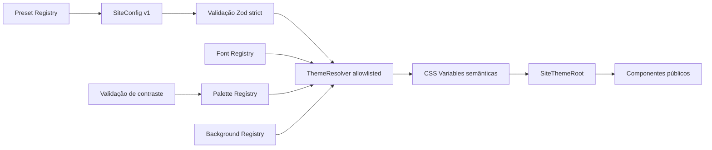

# Punctum Picture — Fase 1: Motor de Identidade

Data: 22 de agosto de 2026  
Escopo: contrato visual versionado, registries allowlisted, resolver de tema,
tokens semânticos e aplicação server-first no site público  
Fora do escopo: Studio UI, persistência de configuração, draft/publish,
preview, snapshots, sections dinâmicas, variants estruturais e redesign

## 1. Objetivo

A Fase 1 transforma a aparência atual do Punctum em uma configuração válida,
tipada e reproduzível. O objetivo não é oferecer controles à fotógrafa ainda,
mas garantir que uma interface futura possa trabalhar com escolhas semânticas
seguras em vez de CSS, HTML ou valores técnicos livres.

O resultado preserva a aparência pública atual. O preset `punctum-default`
representa a identidade violeta, orgânica e editorial existente e é ao mesmo
tempo baseline, configuração inicial e fallback seguro.

## 2. Arquitetura implementada



Fluxo atual:

```text
punctum-default em código
  -> siteConfigSchema
  -> resolveSiteTheme
  -> conjunto fechado de CSS variables
  -> SiteThemeRoot
  -> CSS público existente
```

Os componentes públicos não recebem `ThemeConfig` e não conhecem registries.
Eles continuam consumindo classes e variáveis semânticas. O admin permanece
fora de `SiteThemeRoot` e não carrega um editor.

## 3. SiteConfig

Shape implementado:

```ts
type SiteConfig = {
  schemaVersion: 1;
  identity: {
    sourcePresetId: "punctum-default";
  };
  theme: ThemeConfig;
};
```

O contrato é pequeno, serializável e extensível. Copy, composição de páginas,
sections, dados de portfólio e settings de negócio não foram incorporados.
Álbuns e settings continuam com as fontes de verdade estabelecidas na Fase 0.

`siteConfigSchema` é `strict` em todos os níveis relevantes. Propriedades
extras, enums desconhecidos, fonte livre, palette livre, background externo ou
versão desconhecida são rejeitados.

APIs disponíveis:

- `validateSiteConfig`: validação estrita que lança erro;
- `safeParseSiteConfig`: resultado com config, origem e issues;
- `parseSiteConfig`: parser tolerante que retorna o default seguro;
- `resolveSiteTheme`: valida primeiro e só então resolve tokens.

## 4. ThemeConfig

Shape implementado:

```ts
type ThemeConfig = {
  palette: {
    id: "punctum-violet";
    mode: "light" | "dark";
  };
  typography: {
    headingFamily: HeadingFontFamilyId;
    bodyFamily: BodyFontFamilyId;
    headingScale: "restrained" | "editorial" | "display";
    bodyScale: "compact" | "comfortable";
    headingWeight: "regular" | "medium" | "semibold";
    headingTracking: "tight" | "normal";
  };
  shape: { radius: "square" | "soft" | "rounded" };
  spacing: { density: "compact" | "balanced" | "spacious" };
  container: { width: "narrow" | "standard" | "wide" };
  shadow: { style: "none" | "soft" | "graphic" };
  motion: { intensity: "none" | "subtle" | "expressive" };
  image: {
    treatment: "natural" | "soft" | "contrast" | "monochrome";
  };
  background: {
    style: "plain" | "organic-glow" | "soft-image" | "editorial-texture";
    assetId: ApprovedBackgroundAssetId | null;
  };
  collage: {
    style:
      | "off"
      | "polaroid"
      | "editorial-collage"
      | "patchwork"
      | "moodboard";
  };
};
```

O shape interno é deliberadamente mais rico que a futura UI. A interface não
deverá apresentar propriedades como `letter-spacing` ou `font-size`. Ela poderá
traduzir combinações para escolhas como “Títulos mais marcantes”, “Mais espaço”
e “Movimento suave”.

## 5. schemaVersion

`SITE_CONFIG_SCHEMA_VERSION` vale `1` e o schema aceita somente essa versão.
Uma versão futura não será interpretada silenciosamente como v1: enquanto não
existir migration explícita, o parser cai em `punctum-default`.

Estratégia futura:

1. ler `schemaVersion` como dado não confiável;
2. aplicar uma função explícita `vN -> vN+1` por salto suportado;
3. validar o resultado no schema corrente;
4. manter snapshots originais imutáveis quando a persistência versionada for
   criada;
5. nunca inferir compatibilidade eterna por propriedades opcionais.

Não foi criado um framework de migrations de config nesta fase.

## 6. Design tokens

O resolver emite apenas nomes contidos em `THEME_CSS_VARIABLE_NAMES`.

Principais famílias:

- cores: `--color-background`, `--color-surface`,
  `--color-foreground`, `--color-muted`, `--color-primary`,
  `--color-secondary`, `--color-accent`, `--color-border` e cores de contraste;
- tipografia: `--font-heading`, `--font-body`, pesos, tracking e escalas por
  superfície;
- forma: `--radius-control`, `--radius-surface`, `--radius-card` e pill;
- spacing: padding de section, gap editorial e larguras de container;
- shadow: superfície e elemento flutuante;
- motion: durações, distância e escalas de imagem;
- imagem: filtros natural, hover e manifesto;
- fundo: página, site, carousel, manifesto, contato, arquivo, rodapé, ensaio e
  lightbox;
- preparação: `--collage-style`, ainda sem consumo estrutural.

Os aliases legados (`--ink`, `--paper`, `--wine`, `--purple` etc.) agora são
pontes para os tokens semânticos dentro de `.site-shell`. Isso permite uma
refatoração incremental das mais de 3.000 linhas de CSS sem reescrever a
cascade ou alterar o layout.

Continuam fixos em código: breakpoints, media queries, z-index, semântica,
focus, `sizes`, prioridades de imagem, presets de mídia e regras responsivas.

## 7. Font Registry

Fontes registradas:

| ID interno | Linguagem futura | Origem | Papéis |
| --- | --- | --- | --- |
| `cormorant-garamond` | Elegante | `next/font` | títulos |
| `manrope` | Moderna | `next/font` | títulos e corpo |
| `georgia-editorial` | Clássica | sistema | títulos e corpo |
| `system-sans` | Essencial | sistema | corpo |

O default permanece Cormorant Garamond + Manrope. URLs, imports, nomes livres
e CSS de fonte não fazem parte do schema.

As duas web fonts atuais continuam declaradas em `app/layout.tsx` por
`next/font/google`, como antes. As alternativas iniciais usam stacks de sistema
e não aumentam download ou bundle. Uma nova web font deverá ser adicionada por
developer ao build e ao registry; a futura usuária apenas selecionará opções
já aprovadas.

## 8. Preset Registry

Preset registrado:

- `punctum-default` / “Punctum original”.

Cada entrada carrega um `SiteConfig` completo validado pelo mesmo schema do
renderer. Não há React exclusivo, página duplicada ou ramificação de markup por
preset. Nenhum segundo preset experimental foi necessário para provar a
arquitetura.

## 9. ThemeResolver

`resolveSiteTheme` nunca copia propriedades arbitrárias do input para CSS.
Cada enum seleciona valores dentro de maps fechados; fontes, palettes e assets
são obtidos por registries.

Saída:

```ts
type ResolvedSiteTheme = {
  config: SiteConfig;
  cssVariables: Record<ThemeCssVariableName, string>;
  didFallback: boolean;
  issues: readonly string[];
};
```

Uma config inválida gera o conjunto completo de tokens de `punctum-default` e
marca `didFallback`. Strings maliciosas não são interpoladas.

## 10. Aplicação no frontend

`SiteThemeRoot` é o único wrapper temático público. Home, Portfólio, Arquivo,
Contato e Ensaio usam esse componente. Ele aplica:

- CSS variables resolvidas;
- `data-theme-preset`;
- `data-theme-mode`;
- `data-theme-motion`;
- `data-theme-background`;
- `data-theme-collage`;
- `data-theme-fallback` somente em fallback.

Não há prop drilling e nenhum card, header, galeria ou formulário conhece
`ThemeConfig`. O resolver roda no servidor; não foi adicionado JavaScript de
tema ao cliente.

## 11. Persistência adotada

Não há persistência nova na Fase 1. O `SiteConfig` canônico vive em código como
`PUNCTUM_DEFAULT_SITE_CONFIG` e chega ao renderer diretamente.

Essa decisão evita antecipar a arquitetura de snapshots da Fase 4. Também não
mistura o config visual ainda não editável com `site_settings`, que continua
governando brand, apresentação, contato e SEO conforme a Fase 0.

Não houve alteração em D1, `db/schema.ts`, migrations, Worker ou Cloudflare
remoto.

## 12. Estratégia futura de config migrations

Quando snapshots forem implementados, o JSON persistido usará exatamente este
contrato versionado. O carregador deverá:

- limitar tamanho e profundidade;
- ler a versão;
- migrar por funções explícitas;
- validar novamente;
- usar fallback seguro sem sobrescrever o snapshot inválido;
- registrar erro para diagnóstico;
- publicar apenas configurações válidas.

## 13. Accessibility guardrails

- palette e modo precisam corresponder;
- a palette default é validada em build para pares textuais com mínimo 4.5:1;
- foco visível não é configurável;
- `prefers-reduced-motion` permanece soberano e não pode ser anulado pelo
  config;
- `motion: none` reduz tokens, mas não remove regras globais de acessibilidade;
- HTML, landmarks, heading order, alt text e ordem de foco continuam em código;
- fontes e tratamentos são allowlisted;
- background fotográfico exige asset interno aprovado.

## 14. Suporte planejado a múltiplas fontes

O schema já diferencia fontes de heading e body e limita o papel de cada
entrada. Labels e descrições estão prontos para uma UI leiga. Fontes web futuras
continuam build-time constrained: developer registra a fonte, pesos usados,
fallback e papéis; o Studio só seleciona o ID.

Carregar dinamicamente qualquer URL de fonte foi deliberadamente excluído.

## 15. Suporte planejado a fundos visuais

Estilos reconhecidos: limpo, luz orgânica, imagem suave e textura editorial.
Somente `organic-glow` é usado pelo default público.

`soft-image` exige `assetId`; o único asset técnico inicialmente aprovado é
`manifesto-portrait`, resolvido internamente para `/photos/p061.jpg`. O path não
vem do config e não existe campo de URL. A opção está coberta pelo motor, mas
não foi exposta nem ativada no site.

Upload, seleção de mídia publicada, overlay configurável e catálogo de assets
de usuário ficam para uma fase posterior com validação própria.

## 16. Suporte planejado a collage/patch styles

O eixo `collage.style` representa linguagem visual aprovada. O default é
`off`. Os IDs planejados são aceitos e resolvidos como metadado, mas não alteram
markup nem posicionamento nesta fase.

Uma implementação futura deverá ligar cada ID a uma variant responsiva testada.
Não haverá canvas, coordenadas, layers livres, resize pixel a pixel ou CSS
arbitrário.

## 17. Performance

- nenhum editor ou DnD foi importado pelo site público;
- nenhum fetch adicional foi criado;
- o default é resolvido no servidor;
- as CSS variables são aplicadas no HTML inicial;
- alternativas de sistema não geram requests de fonte;
- as duas fontes web atuais preservam o comportamento de build existente;
- infraestrutura e transformação de imagens não foram alteradas.

## 18. Arquivos alterados na Fase 1

Criados:

- `shared/config/background-registry.ts`
- `shared/config/contrast.ts`
- `shared/config/defaults.ts`
- `shared/config/font-registry.ts`
- `shared/config/index.ts`
- `shared/config/palette-registry.ts`
- `shared/config/preset-ids.ts`
- `shared/config/preset-registry.ts`
- `shared/config/schema.ts`
- `shared/config/site-config.ts`
- `shared/config/theme-resolver.ts`
- `shared/config/version.ts`
- `app/components/SiteThemeRoot.tsx`
- `app/lib/site-theme.ts`
- `tests/unit/site-config.spec.ts`
- `tests/unit/theme-resolver.spec.ts`
- este documento

Atualizados:

- `app/globals.css`
- `app/page.tsx`
- `app/portfolio/page.tsx`
- `app/arquivo/page.tsx`
- `app/contato/page.tsx`
- `app/ensaios/[slug]/page.tsx`

## 19. Testes

Cobertura adicionada:

- default de `SiteConfig` e `ThemeConfig` válido;
- `schemaVersion` obrigatório;
- rejeição de enums e propriedades extras;
- rejeição de `FontFamilyId` livre;
- consistência do Font Registry;
- validação de todo preset pelo mesmo schema;
- contraste mínimo da palette aprovada;
- tokens determinísticos do default;
- lista fechada de nomes de CSS variables;
- fallback seguro para config inválida;
- ausência de propagação de CSS arbitrário;
- fundo fotográfico restrito a asset interno;
- props do wrapper público e marcador de fallback.

O build completo também valida a renderização real dos Server Components com
`SiteThemeRoot` nas cinco superfícies públicas.

### Verificação visual local

Foram verificados em navegador local:

- Home em 1440 × 900;
- Home em 390 × 844;
- Portfólio com 13 cards;
- Arquivo com 112 fotografias;
- ensaio “Fé e Tradição” com 7 frames;
- Contato;
- Admin em desktop.

Não foram encontrados overflow horizontal, imagens quebradas ou erros/warnings
no console. A primeira passagem revelou que um fallback tipográfico sem escopo
afetava o corpo do admin; ele foi removido e o painel voltou a usar Manrope,
enquanto os tokens de fonte permanecem restritos a `SiteThemeRoot`.

As migrations já existentes `0004` e `0005` foram aplicadas somente ao D1
local para permitir a verificação com o acervo real. Nenhuma migration foi
criada ou aplicada remotamente nesta fase.

Diferenças visuais deliberadas encontradas: nenhuma.

## 20. Limitações

- há somente uma palette e um preset públicos em código;
- cores personalizadas ainda não existem;
- contraste é verificado para palettes registradas, não há editor de cor;
- somente as fonts atuais e alternativas de sistema estão disponíveis;
- `SiteConfig` ainda não é persistido;
- `collage.style` é preparatório e não renderiza composição;
- background e image treatment não possuem UI;
- o CSS mantém aliases legados como ponte de migração incremental;
- sections, copy editorial e variants estruturais não fazem parte deste
  contrato.

## 21. Itens adiados

- Punctum Studio UI;
- controles de fonte, palette, fundo, imagem e motion;
- custom palette e validação interativa;
- persistência, snapshots, draft/publish e rollback;
- preview iframe;
- config migrations persistidas;
- SectionRegistry e PublicRenderer genérico;
- drag-and-drop e reordenação de sections;
- variants de hero, galerias e páginas;
- presets adicionais;
- uploads de background;
- collage/patch renderer;
- undo/redo.

## Confirmação de limite de fase

**PUNCTUM STUDIO UI NOT IMPLEMENTED IN PHASE 1**
