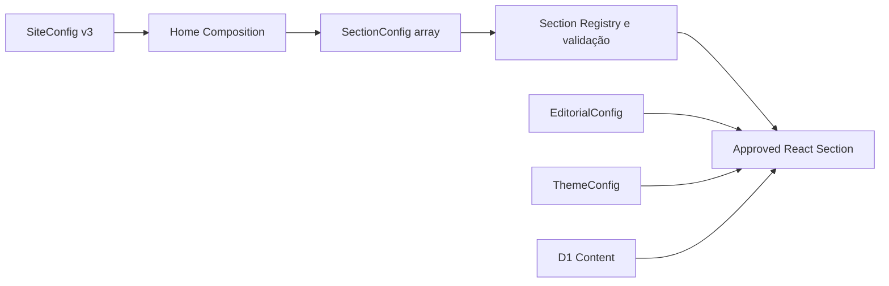

# Punctum Picture — Fase 3: Estrutura Editorial da Página

## 1. Objetivo

A Fase 3 transforma a Home em uma composição formal de blocos editoriais aprovados, sem expor essa complexidade para Maria e sem criar um page builder. A configuração determina quais blocos existem, sua ordem, seu estado e sua variante; conteúdo, identidade visual e dados do portfólio continuam em suas fontes próprias.

Não foram adicionados drag-and-drop, controles de ordem, preview, snapshots, duplicação, inserção de blocos, CSS/HTML livre ou novas propostas visuais.

## 2. Sections identificadas

A extração foi derivada do markup real da Home, na ordem que já existia:

1. `hero` — **Capa**;
2. `statement` — **Frase de abertura**;
3. `photo-reel` — **Percurso de fotografias**;
4. `featured-work` — **Trabalhos em destaque**;
5. `about` — **Sobre mim**;
6. `contact` — **Contato**.

Header e footer permanecem no chrome global do site. Eles não são sections reordenáveis da Home.

## 3. Extração da Home

`app/page.tsx` passou a cuidar apenas de:

- carregar `SiteConfig` e dados públicos server-first;
- compor JSON-LD;
- renderizar header, `HomeRenderer` e footer.

Cada bloco foi extraído para `app/sections/home/`, preservando as classes, IDs, landmarks, headings, imagens, componentes client já necessários e regras responsivas existentes. Os únicos atributos novos no HTML são `data-home-section-id`, `data-home-section-type` e `data-home-section-variant`, invisíveis e usados para inspeção/teste.

## 4. SectionRegistry

`shared/config/section-registry.ts` é o catálogo fechado de sections permitidas. Cada definição contém:

- `type` interno;
- `label` e `description` em PT-BR natural;
- `canonicalId` para a instância atual;
- `required`;
- `allowMultiple`;
- `futureCanRepeat`, apenas como indicação de evolução, sem liberar repetição hoje;
- `defaultVariant`;
- `allowedVariants`.

O registry não contém JSX, paths de componentes ou código persistível. Um valor vindo do banco nunca escolhe um import, módulo ou componente arbitrário.

## 5. Metadata amigável

Os nomes técnicos ficam restritos ao contrato interno. A metadata já está pronta para uma UI futura apresentar “Capa”, “Sobre mim” e “Trabalhos em destaque”, acompanhados de descrições curtas. Maria não verá `section.type`, IDs ou nomes de componentes.

## 6. CompositionConfig

O shape final é mínimo e fechado:

```ts
type CompositionConfig = {
  home: {
    sections: Array<{
      id: string;
      type: SectionType;
      enabled: boolean;
      variant: SectionVariantId;
    }>;
  };
};
```

Na implementação, `HomeSectionConfig` é uma união discriminada por `type`; cada tipo aceita apenas sua variante registrada. Os objetos são `strict`, IDs têm formato e limite validados, e não há `Record<string, unknown>`, `style`, conteúdo editorial ou settings genéricos.

## 7. SiteConfig v3

`SiteConfig` evoluiu explicitamente de v2 para v3:

```text
SiteConfig v3
├── identity
├── theme
├── editorial
└── pages
    └── home
        └── sections[]
```

`PUNCTUM_DEFAULT_SITE_CONFIG.pages` reproduz exatamente a ordem anterior da Home com IDs canônicos estáveis.

## 8. Migração de config

A migração é de contrato JSON, não de banco:

- v3 é validado diretamente;
- v2 recebe `pages` com a composição default e preserva `identity`, `theme` e `editorial`;
- v1 recebe `editorial` e `pages` default;
- versão desconhecida ou configuração inválida cai no fallback seguro conhecido;
- a primeira gravação posterior pelo Studio serializa a unidade como v3.

A tabela D1 e a coluna JSON existentes comportam v3, portanto nenhuma migration SQL foi criada ou executada. Nenhuma migration remota foi executada.

## 9. SectionRenderer

`HomeRenderer` recebe o `SiteConfig` já validado e dados públicos já resolvidos. O fluxo é:



O plano de renderização liga pares aprovados `type:variant` a componentes importados estaticamente. Não existem `eval`, dynamic import controlado pelo banco, component path persistido, JSX em JSON ou HTML configurável.

## 10. Cardinalidade

| Section | Obrigatória | Multiplicidade atual | Pode fazer sentido repetir no futuro |
| --- | --- | --- | --- |
| Capa | Sim | Uma | Não |
| Frase de abertura | Não | Uma | Sim, após nova regra/versionamento |
| Percurso de fotografias | Não | Uma | Sim, após nova regra/versionamento |
| Trabalhos em destaque | Não | Uma | Sim, após nova regra/versionamento |
| Sobre mim | Não | Uma | Não |
| Contato | Não | Uma | Não |

Hoje todas são singleton. IDs repetidos e duplicação do mesmo tipo são rejeitados. A Capa precisa estar presente e ativa. O motor aceita desativar sections opcionais, mas esse controle ainda não é mostrado a Maria.

## 11. Required e optional

A Capa é o único bloco estrutural obrigatório da Home. Os demais são opcionais no contrato para permitir evolução editorial controlada, embora todos estejam ativos no default. Header, navegação, skip link e footer ficam fora da composição e não podem ser removidos por essa configuração.

## 12. Variants

A infraestrutura de variants está comprovada sem criar um catálogo artificial:

- `hero / cinematic`;
- `statement / manifesto`;
- `photo-reel / horizontal`;
- `featured-work / editorial-grid`;
- `about / portrait`;
- `contact / split-form`.

Cada tipo possui apenas a variante que representa o design atual. Variants desconhecidas são rejeitadas no servidor. Nenhuma nova aparência foi introduzida.

## 13. Content × Theme × Composition

- **Content:** `EditorialConfig` governa copy; D1 governa álbuns, categorias e fotografias.
- **Theme:** `ThemeConfig` governa identidade visual global e tokens aprovados.
- **Composition:** `pages.home.sections[]` governa existência, ordem, `enabled` e variant.

Textos e dados de portfólio não foram duplicados dentro das sections.

## 14. Collage / patch

O eixo `theme.collage` foi preservado em v3 por compatibilidade com a Fase 2. A análise confirma que uma composição como patchwork ou collage pertence melhor a uma section/variant específica — por exemplo, uma futura variant de `featured-work` — do que a um efeito estrutural global.

Não houve mudança destrutiva nesta fase. A migração deve ocorrer numa próxima versão explícita do schema, quando existir uma variant real e testada para receber esse estado. Nenhum canvas ou collage foi implementado.

## 15. Backgrounds por section

O background global permanece em `ThemeConfig`, pois ainda expressa a personalidade geral do site. A arquitetura discriminada permite que, no futuro, uma variant específica ganhe um enum fechado de superfície ou referência allowlisted. Não foi adicionado `style`, URL livre ou objeto aberto a `SectionConfig`.

## 16. SSR

A Home continua um Server Component assíncrono. D1, settings, config, álbuns destacados e imagens do percurso são resolvidos no servidor. A ordem é aplicada diretamente pelo array antes de produzir o DOM; não há fetch client para composição nem JavaScript público para ordenar sections.

## 17. Acessibilidade

- a ordem do array é a ordem real do DOM;
- não foi usado CSS `order`;
- landmarks, `aria-labelledby`, IDs de headings, skip link e hierarquia atual foram preservados;
- componentes client existentes mantêm teclado, foco e reduced motion;
- atributos essenciais não fazem parte da configuração editável.

## 18. Performance

O renderer público importa somente as sections aprovadas e seus componentes já existentes. Código do Studio e bibliotecas de drag-and-drop não entram no bundle público. Não foi criado componente client agregador, nova query ou fetch pós-hidratação. Imagens, Cloudflare Images e cache existentes permanecem inalterados.

## 19. Testes

Foram adicionadas coberturas para:

- completude e linguagem amigável do registry;
- coerência entre default e allowed variants;
- rejeição de type, variant e propriedade desconhecidos;
- IDs duplicados, cardinalidade e Capa obrigatória;
- ordem default, reordenação pelo array e `enabled` opcional;
- plano de renderização aprovado para cada `type:variant`;
- migração v1/v2 para v3 e fallback seguro;
- API do Studio rejeitando section/variant inválidas;
- configuração pública expondo a composição validada.

Os testes das Fases 0, 1 e 2 permanecem no conjunto completo.

## 20. Arquivos alterados

Arquitetura e contratos:

- `shared/config/section-registry.ts`;
- `shared/config/composition.ts`;
- `shared/config/schema.ts`;
- `shared/config/defaults.ts`;
- `shared/config/site-config.ts`;
- `shared/config/version.ts`;
- `shared/config/index.ts`;
- `shared/site-config-storage.ts`.

Renderer e sections:

- `app/page.tsx`;
- `app/sections/home/HomeRenderer.tsx`;
- `app/sections/home/render-plan.ts`;
- `app/sections/home/section-attributes.ts`;
- seis componentes `Home*Section.tsx` em `app/sections/home/`.

Testes e documentação:

- `tests/unit/section-registry.spec.ts`;
- `tests/unit/home-render-plan.spec.ts`;
- `tests/unit/site-config.spec.ts`;
- `tests/integration/worker.spec.ts`;
- este documento.

## 21. Limitações

- somente a Home possui composição formal;
- todas as sections atuais são singleton;
- cada section possui uma única variant;
- não há edição de composição no Studio;
- não há preview de composição nem versionamento draft/published;
- a composição persistida continua usando a unidade JSON atual, sem snapshots.

## 22. Itens adiados

- UI de reordenação e drag-and-drop acessível;
- habilitar/desabilitar sections por Maria;
- adicionar, remover ou duplicar sections;
- variants adicionais e settings discriminados por variant;
- backgrounds específicos por section;
- migração do eixo global de collage para uma variant apropriada;
- preview iframe, draft/publish, snapshots, rollback e undo/redo;
- qualquer forma de canvas, posicionamento livre, nesting ou plugin system.
