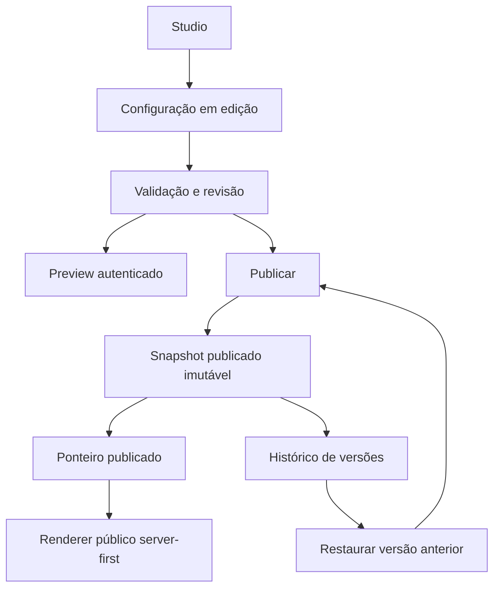

# Punctum Picture — Fase 4: rascunho, preview e publicação segura

## 1. Objetivo

A Fase 4 separa experimentar de publicar. O Studio passa a trabalhar sobre um rascunho persistente; o site público lê exclusivamente um snapshot publicado. Não foram adicionados drag-and-drop, gerenciamento de sections, novas variants ou controles avançados.

## 2. Modelo de dados

Foram adicionadas duas tabelas:

- `site_config_versions`: um rascunho mutável e snapshots publicados imutáveis, todos contendo o `SiteConfig` completo e seu `schema_version`;
- `site_config_pointers`: ponteiro singleton para a versão em edição e para a versão publicada.

Cada versão registra autoria, datas, revisão, origem e eventual versão restaurada. Existe índice parcial que garante apenas um rascunho.

## 3. Migration

A migration canônica é `migrations/0007_site_config_versions.sql`, compatível com SQLite/D1. Ela não altera migrations anteriores e copia o singleton `site_config`, quando presente, para a primeira publicação e para o primeiro rascunho. Em instalações sem singleton, o bootstrap ocorre no primeiro acesso usando os defaults e settings legados validados.

A migration não foi aplicada remotamente. O fluxo continua sendo `npm run db:migrate:local` para desenvolvimento e `npm run db:migrate:remote` somente em uma operação remota futura explicitamente autorizada.

## 4. Fonte de verdade

Depois do bootstrap, a fonte canônica é:

- personalidade, copy e composição públicas: versão apontada por `published_version_id`;
- edição e preview: versão apontada por `draft_version_id`;
- álbuns, fotografias e categorias: D1, como nas fases anteriores;
- contato, marca e SEO básico ainda não pertencentes ao `SiteConfig`: `site_settings`.

A tabela `site_config` permanece somente como fonte de bootstrap para instalações anteriores. Nenhum save ou render novo escreve nela.

## 5. Publicado

O renderer público chama `readPublicSiteConfigState`, resolve o ponteiro publicado, migra a configuração apenas em memória quando necessário e valida o resultado antes do render. Ele nunca consulta o rascunho.

## 6. Em edição

Ao abrir o Studio, `readDraftSiteConfigState` cria o primeiro par publicado/rascunho se ainda não existir. Se já existir, o mesmo rascunho é retomado. Maria não precisa criar ou nomear um rascunho.

## 7. Revisões

O rascunho possui um contador `revision`. Cada save aceito incrementa esse contador. A revisão não aparece na interface; ela existe apenas para impedir que uma aba antiga sobrescreva uma edição mais recente.

## 8. Autosave

O Studio salva após 700 ms sem novas alterações. A interface usa somente:

- “Salvando…”;
- “Tudo salvo”;
- “Não foi possível salvar” ou uma explicação humana mais específica.

Uma falha preserva o estado local e oferece “Tentar salvar novamente”, sem loop automático agressivo. Saves em andamento são serializados; uma edição feita durante um save é enviada no ciclo seguinte.

## 9. Concorrência otimista

O `PATCH /admin/api/studio` exige a revisão conhecida pelo cliente. O `UPDATE` usa compare-and-swap. Em conflito, o backend responde sem escrever e o Studio preserva as mudanças locais, explica que outra aba alterou o conteúdo e oferece carregar a versão mais recente.

Não foi criado CRDT nem colaboração em tempo real.

## 10. Publicação

“Publicar alterações” primeiro garante que o estado local foi salvo e então chama `POST /admin/api/studio/publish`. O backend:

1. valida o `SiteConfig` completo;
2. valida referências allowlisted;
3. verifica ponteiros e revisão;
4. cria um novo snapshot publicado;
5. troca o ponteiro publicado;
6. alinha o rascunho à nova publicação;
7. sincroniza `tagline` e `about_text` legados;
8. registra auditoria;
9. aplica a retenção de histórico.

Publicar é uma promoção no D1, não um deploy.

## 11. Atomicidade

As etapas críticas são preparadas como um único `D1Database.batch()`, que o D1 executa como transação. As escritas usam condições sobre ponteiro e revisão. Se a configuração ficou obsoleta ou uma instrução falha, o ponteiro público anterior permanece válido e não há publicação parcial.

## 12. Preview

O preview visível em `/admin/studio/preview` é reescrito internamente pelo Worker para `/studio-preview-internal`. A rota interna direta é bloqueada. A página usa o mesmo `HomeExperience`, `HomeRenderer`, sections, CSS, dados de álbuns e carrossel da Home pública; somente a origem do `SiteConfig` muda para o rascunho.

O iframe recarrega após um autosave bem-sucedido. `postMessage` foi adiado porque o rascunho persistido já entrega fidelidade sem criar uma fonte temporária concorrente.

## 13. CSP e X-Frame

Somente a resposta de preview recebe:

- `X-Frame-Options: SAMEORIGIN`;
- `frame-ancestors 'self'`;
- `Cache-Control: private, no-store, max-age=0`;
- `X-Robots-Tag: noindex, nofollow, noarchive`.

Todas as demais páginas continuam com `X-Frame-Options: DENY` e `frame-ancestors 'none'`. A exceção não é global.

## 14. Cache

O site inteiro já é `force-dynamic` no layout raiz. O carregamento server-first usa memoização por request do React. A API pública de configuração usa `no-store`, evitando servir uma revisão anterior depois de publicar. O preview também é `no-store`. Imagens preservam seu cache específico e continuam fora dessa decisão.

Não foi adicionada dependência externa nem purge remoto. Uma cache versionada por ID poderá ser avaliada apenas se medições futuras mostrarem necessidade.

## 15. Histórico

Cada publicação cria um snapshot novo; autosaves não criam histórico. A retenção inicial é de 25 versões publicadas. A UI lista data, horário e autoria quando disponível, sem expor IDs ou schema.

## 16. Restauração

“Restaurar esta versão” valida o snapshot escolhido e cria uma nova publicação baseada nele. O ponteiro nunca volta silenciosamente e nenhuma versão anterior é mutada. A auditoria registra `restoredFromVersionId`.

## 17. Migrations de configuração

Snapshots guardam `schemaVersion`. O loader atual suporta SiteConfig v1, v2 e v3. Migrações v1 → v3 e v2 → v3 acontecem em memória por passos explícitos. O JSON original legado ou snapshot anterior não é sobrescrito durante a leitura.

## 18. UX desktop

O Studio usa duas áreas: controles simples à esquerda e preview fiel à direita. Os controles continuam “Escrita”, “Textos” e “Fundo”. O topo comunica claramente se há alterações não publicadas e oferece publicar ou descartar. Há presets internos de preview chamados “Computador”, “Tablet” e “Celular”.

## 19. UX mobile

No celular os controles permanecem em uma coluna. “Ver como ficou” abre o preview em uma superfície de tela inteira, com ação explícita “Voltar à edição”. Todas as ações essenciais — editar, visualizar, publicar, descartar e restaurar — continuam disponíveis por toque.

## 20. Acessibilidade

Os controles usam elementos `button`, `aria-pressed`, `aria-current`, grupos rotulados, status com `aria-live`, alerta de conflito e foco visível. Os touch targets têm altura mínima. O preview mantém a ordem DOM e as garantias de acessibilidade do renderer real.

## 21. Segurança

- todas as rotas do Studio e preview usam a autenticação administrativa existente;
- todo payload é validado novamente no Worker;
- revision e payloads usam schemas estritos;
- fontes, backgrounds, sections e variants permanecem allowlisted;
- referências internas são validadas antes de publicar;
- HTML, CSS, JavaScript e URLs arbitrárias continuam bloqueados;
- a rota interna do preview não é pública;
- o preview não entra no sitemap nem em indexação.

## 22. Testes

A cobertura inclui bootstrap, rascunho, revisão, conflito, isolamento público, publicação, falha segura, descarte, histórico, restauração, migração v2, validação, headers do preview e bloqueio de framing público. Os testes das Fases 0–3 foram preservados.

Os comandos obrigatórios e seus resultados finais são registrados na saída da tarefa.

## 23. QA manual

A jornada completa foi executada no ambiente local:

1. uma copy foi alterada e salva automaticamente;
2. o preview mostrou a mudança enquanto a Home pública permaneceu igual;
3. o Studio foi recarregado e recuperou o rascunho;
4. a mudança foi publicada e apareceu na Home sem build/deploy;
5. uma segunda mudança foi criada e descartada;
6. a versão anterior foi restaurada como uma nova publicação;
7. escrita e fundo foram trocados e refletidos no preview, depois descartados;
8. Computador, Tablet e Celular foram exercitados;
9. o preview móvel abriu em tela cheia e retornou à edição;
10. Home, Portfólio, Arquivo, Ensaio, Contato, Admin e Studio foram verificados a 390 × 844 sem overflow horizontal;
11. não houve erro ou warning no console das páginas verificadas.

## 24. Compatibilidade com settings anteriores

`brandName`, contato, WhatsApp, Instagram e SEO básico continuam em `site_settings`. `tagline` e `about_text` permanecem na API/tabela para clientes antigos e bootstrap, porém deixaram de ser uma segunda fonte de copy no renderer. Seus controles foram removidos de “Configurações”; a UI direciona Maria ao Studio. Na publicação, esses dois campos são sincronizados atomicamente para manter consumidores legados coerentes.

## 25. Itens adiados

- undo/redo local: adiado para a Fase 5 para não competir com autosave, conflito e publicação;
- atualização instantânea por `postMessage`: adiada; o iframe recarrega após persistência;
- cache público versionado avançado;
- drag-and-drop, reorder, enable/disable, novas sections e variants;
- upload arbitrário de fundo, editor avançado de cores e collage completo.

## Fluxo

