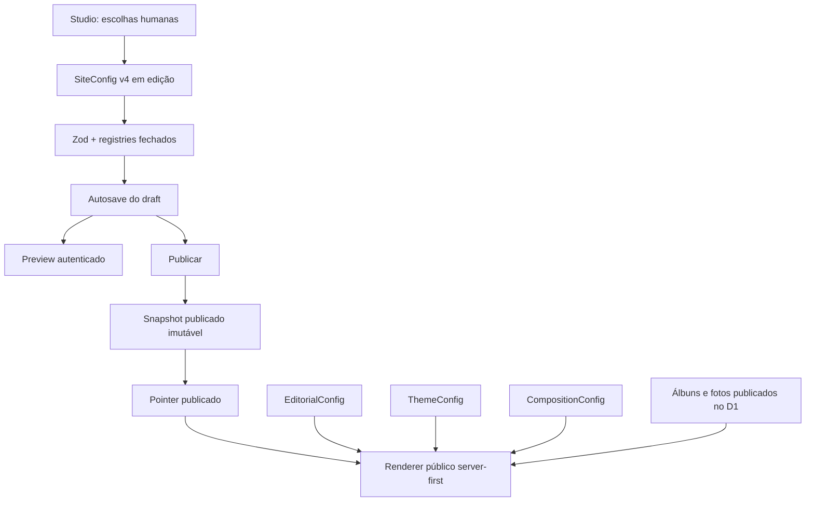

# Punctum Studio e revitalização visual pública

## 1. Objetivo

Esta macrofase transforma o motor criado nas Fases 0–4 em uma experiência de personalização utilizável por Maria Helena e, ao mesmo tempo, eleva o frontend público. O produto continua sendo um portfólio editorial dirigido por componentes aprovados: não existe canvas livre, DOM editável, CSS/HTML/JavaScript administrável nem posicionamento por coordenadas.

Os princípios preservados são:

- fotografia como protagonista;
- complexidade técnica interna e linguagem simples na interface;
- editar não significa publicar;
- preview e público usam o mesmo renderer;
- conteúdo, identidade e composição permanecem responsabilidades separadas;
- configuração antiga válida continua carregando por migration explícita.

## 2. Arquitetura

O código público nunca importa `@dnd-kit`, navegador de fontes, seletor de mídia ou histórico local. O renderer recebe um `SiteConfig` já validado e escolhe componentes em um mapping fechado em código.

## 3. Studio

`/admin/studio` agora possui quatro áreas:

- **Estilo**: clima pronto, cores, escrita, fundo, movimento e tratamento fotográfico;
- **Textos**: copy editorial já tipada, com contexto e limites;
- **Página**: ordem, visibilidade e composição das partes da Home;
- **Fotos**: seleção visual de fotografias publicadas para fundos e Patch.

Desktop usa controles ao lado do preview fiel. No celular, os controles ocupam a tela e “Ver como ficou” abre o preview em superfície dedicada. A aplicação das escolhas continua sendo autosave de draft; “Publicar alterações” é a única promoção para o site público.

## 4. UX leiga

IDs e conceitos internos não aparecem. A UI diz “Capa”, “Mais espaço”, “Fundo desta parte”, “Colagem editorial”, “Tudo salvo” e “Alterações não publicadas”. Não diz `SectionConfig`, `density`, `surface`, `revision`, `snapshot` ou `schemaVersion`.

Todas as ações básicas são visualmente comparáveis, funcionam por toque e possuem foco de teclado. Opções avançadas de fontes ficam dentro de “Personalizar mais”.

## 5. Presets

Foram criados seis pontos de partida no `PresetRegistry`:

1. **Punctum original** — violeta, orgânico e autoral;
2. **Editorial** — elegante, espaçoso e artístico;
3. **Delicado** — luminoso, sensível e suave;
4. **Intenso** — escuro, cinematográfico e expressivo;
5. **Minimalista** — preciso, leve e silencioso;
6. **Aconchegante** — quente, humano e espontâneo.

Um preset combina palette, par tipográfico, escala, respiro, forma, sombra, movimento, tratamento de imagem, fundo e variants compatíveis. Ele preserva textos, ordem, IDs e visibilidade atuais; portanto é ponto de partida, não tema separado ou bloqueio.

## 6. Fontes

O catálogo usa o `FontRegistry` existente, incluindo o pack local de 40 famílias e os fallbacks aprovados. A experiência simples oferece oito pares: Elegante, Editorial, Delicada, Moderna, Clássica, Marcante, Acolhedora e Manuscrita.

“Personalizar mais” agrupa famílias por percepção, com amostra na própria fonte. O CSS contém somente declarações `@font-face`; o navegador baixa apenas as famílias efetivamente usadas/renderizadas. O público recebe somente as famílias ativas. O catálogo completo existe apenas no bundle administrativo e seus grupos são revelados sob demanda.

## 7. Palettes

Foram registradas seis palettes validadas:

- Violeta orgânico;
- Marfim editorial;
- Rosa delicado;
- Ameixa noturna;
- Tinta minimalista;
- Terra acolhedora.

Cada definição contém cores semânticas e superfícies para carrossel, manifesto, contato, arquivo, rodapé, ensaio e lightbox. Os contrastes textuais obrigatórios são verificados antes da criação do default e cobertos por testes. A UI apresenta amostras de Fundo, Texto, Destaque e Detalhes sem expor nomes de tokens.

## 8. Backgrounds

O fundo global mantém as opções allowlisted:

- Limpo;
- Luz suave;
- Com foto;
- Textura editorial.

Fundo com foto oferece tratamentos controlados: Mais suave, Mais presente, Mais escuro e Mais claro. Não existe campo de URL, pathname ou opacidade livre.

## 9. Photo backgrounds

`GET /admin/api/studio/photos` fornece ao Studio somente fotografias pertencentes a conteúdo publicado. A usuária vê miniatura, ensaio e texto alternativo; nunca vê ID, R2 key ou URL interna.

As escolhas persistem apenas como IDs internos estritos. Antes de salvar ou publicar, o backend confere no D1 se todas as referências continuam publicadas. A renderização usa presets de mídia existentes (`/media/:id/hero` e `/media/:id/card`), preservando focal point e transformações já mantidos pelo acervo.

## 10. Sections

A Home continua composta por seis tipos registrados:

- Capa;
- Frase de abertura;
- Percurso de fotografias;
- Trabalhos em destaque;
- Sobre mim;
- Contato.

Cada card apresenta nome, descrição, miniatura, visibilidade quando permitida, handle de arraste, movimentos alternativos e controles de alto valor. Não foi criado catálogo artificial de novas sections.

## 11. Drag-and-drop

`@dnd-kit/core`, `@dnd-kit/sortable` e `@dnd-kit/utilities` são usados somente no Studio. Há sensores de mouse, toque com tolerância, teclado e auto-scroll padrão. O array persistido determina a ordem real do DOM; CSS `order` não é usado.

## 12. Alternativa acessível de ordenação

Todos os cards oferecem “Mover para cima” e “Mover para baixo”, com nomes acessíveis que incluem a parte afetada. Isso mantém a operação utilizável por teclado e em telas pequenas mesmo sem gesto de arraste.

## 13. Visibilidade e cardinalidade

Capa é obrigatória e aparece como “Sempre visível”. As demais partes podem ser ocultadas. Schemas impedem IDs repetidos, tipos singleton duplicados, variants desconhecidas e ausência da Capa ativa. Duplicação e adição não foram expostas porque nenhum tipo atual é aprovado para múltiplas instâncias no produto entregue.

## 14. Variants

Foram implementadas poucas composições aprovadas:

- **Capa**: Original, Editorial, Tela cheia, Dividida;
- **Frase de abertura**: Manifesto, Centralizada;
- **Percurso**: Original, Filme, Patch;
- **Trabalhos em destaque**: Original, Galeria, Colagem editorial;
- **Sobre mim**: Original, Retrato lateral, Centralizada, Editorial;
- **Contato**: Original, Essencial.

Variant é enum discriminado por `section.type`. O banco nunca armazena path de componente ou JSX. `HOME_SECTION_RENDERERS` mantém o mapping para componentes React conhecidos.

## 15. Collage e Patch

Collage deixou de ser eixo global de `ThemeConfig` e passou a pertencer à section/variant que realmente controla a composição. A migration v3 → v4 converte:

- `patchwork` em `photo-reel / patch`;
- `polaroid`, `editorial-collage` e `moodboard` em `featured-work / collage`;
- `off` em variants default.

Patch é markup fixo responsivo com até seis figuras, alt text preservado, offsets e rotações definidos no código. A seleção explícita aceita zero fotos (fallback seguro do acervo) ou entre três e seis IDs internos únicos. Não existem x/y, resize, layers ou z-index administráveis.

## 16. Backgrounds por section

Cada tipo possui sua própria allowlist de superfícies: Padrão, Claro, Escuro, Destaque e, onde coerente, Foto. O `SectionConfig.appearance` aceita apenas `surface`, `density`, `alignment` e `backgroundImageId`. Uma superfície Foto exige referência interna válida; qualquer outra superfície proíbe essa referência.

## 17. Settings por section

Foram expostos somente controles com alto impacto e baixo risco:

- composição aprovada;
- fundo aprovado;
- espaço: Mais junto, Equilibrado, Mais espaço;
- alinhamento: Editorial ou Centralizado;
- quantidade de trabalhos: 2 a 6, apenas em Destaques.

Não existe `Record<string, unknown>`, padding numérico ou style livre.

## 18. Draft, preview e publish

A infraestrutura da Fase 4 foi preservada. Toda alteração desta macrofase modifica o draft com optimistic concurrency e autosave. O iframe autenticado usa o renderer real e lê apenas draft. O público lê somente o pointer published. Publicação continua sendo promoção atômica no D1, não deploy.

## 19. Undo/redo

O Studio mantém até 40 estados locais recentes. Preset, fonte, palette, fundo, texto, ordem, visibilidade, variant e seleção fotográfica entram no mesmo histórico. Desfazer/refazer preserva a distinção entre estado local, draft salvo e versão publicada. O histórico de teclas não é persistido como versão pública.

## 20. Reset

Há três níveis seguros:

- “Voltar esta parte ao original” em cada section;
- “Restaurar aparência original”, preservando textos e página;
- “Voltar tudo ao original”, com confirmação e sem publicação automática.

## 21. Revitalização pública

O frontend ganhou:

- hierarquia tipográfica mais equilibrada;
- navegação mais silenciosa, com foco e underline discreto;
- espaçamento governado por tokens e densidade da section;
- superfícies compatíveis com palettes claras e escuras;
- fotografia em maior escala, crops responsivos e assimetria controlada;
- transições subordinadas ao nível de movimento e a `prefers-reduced-motion`;
- states de hover que não são necessários no touch.

Não houve substituição da logo oficial.

## 22. Home

A Capa mantém impacto fotográfico e ganhou quatro ritmos possíveis. A Frase de abertura funciona como pausa. O Percurso conserva o carrossel editorial, oferece Filme e uma composição Patch. Trabalhos em destaque podem assumir grid editorial, galeria ou colagem controlada. Sobre mim ganhou composições íntimas diferentes. Contato permanece simples, sem aumento do formulário.

## 23. Portfólio

Filtros, dados D1, SEO e acessibilidade foram preservados. A apresentação usa grid editorial assimétrico, maior distância vertical, títulos em escala configurável e hover de moldura discreta. Mobile usa uma coluna fotográfica com textos legíveis e sem dependência de hover.

## 24. Arquivo

O Arquivo mantém densidade superior ao Portfólio, masonry CSS e lightbox. Foram refinados column-gap, ritmo vertical, captions e filtros touch. No mobile, filtros têm scroll horizontal sem scrollbar visual e cards permanecem em duas colunas quando o viewport comporta.

## 25. Ensaios

A narrativa server-first e o conteúdo D1 permanecem canônicos. O ritmo vertical da galeria foi ampliado e figures alternadas mantêm assimetria sem alterar a ordem semântica. Hero, captions, arquivo final e metadata continuam derivados do álbum publicado.

## 26. Contato

A rota preserva campos e integrações existentes. O hero fotográfico, a escala editorial e o fechamento receberam melhor contraste e ritmo; o formulário não ganhou campos nem dependência visual do Studio.

## 27. Navegação

A navegação pública é discreta, possui foco visível e alvos touch. No celular, a marca e “Conversar” são priorizados; as rotas completas continuam disponíveis pelo conteúdo e rodapé. A logo usa exatamente o asset aprovado, somente com escala, respiro e contraste contextual.

## 28. Mobile

O design mobile foi tratado como composição própria:

- hero com crop e escala específicos;
- assimetrias complexas simplificadas;
- Patch reorganizado em grade de seis colunas;
- colagem de projetos volta a fluxo vertical;
- botões e cards têm alvos de pelo menos aproximadamente 44 px;
- Studio usa quatro áreas roláveis e preview em tela cheia;
- DnD tem botões alternativos sempre disponíveis.

## 29. Acessibilidade

Foram preservados landmarks, headings, ordem DOM, alt text, labels, `aria-pressed`, switch semântico, estados de foco e controle por teclado. Cards visuais não dependem de cor para indicar estado. `prefers-reduced-motion` neutraliza movimentos, transforms e transições não essenciais. Maria não pode desabilitar essas proteções.

## 30. Performance

- Home continua server-first;
- `@dnd-kit` e controles do Studio não entram no renderer público;
- fontes são locais e baixadas sob demanda conforme uso;
- imagens mantêm dimensões, `sizes`, lazy loading e presets do Worker;
- fotos do seletor usam o preset `card` existente;
- não foi adicionada query pública por section;
- configuração continua sendo um snapshot único, cacheável por versão;
- nenhum efeito pesado, scroll hijacking ou biblioteca de animação foi adicionado.

## 31. Segurança

Schemas Zod são `.strict()` e registries fecham fontes, palettes, backgrounds, assets, sections e variants. IDs de imagem aceitam apenas caracteres seguros e comprimento limitado. D1 valida integridade referencial e estado publicado antes de autosave/publicação. Continuam bloqueados CSS, HTML, JavaScript, URL livre, class name, component path e chaves desconhecidas.

Preview continua autenticado, same-origin, `no-store` e `noindex`; a exceção de framing não foi ampliada ao público.

## 32. Evolução do SiteConfig e migrations

### Versão anterior

`SiteConfig v3`:

- `ThemeConfig.collage` era metadata global;
- composition tinha `id`, `type`, `enabled` e uma variant default por tipo;
- fundo global não aceitava foto interna nem tratamento controlado.

### Nova versão

`SiteConfig v4`:

- remove collage global;
- adiciona variants reais discriminadas;
- adiciona `SectionAppearance` fechado;
- adiciona `photoIds` somente ao Percurso e `itemCount` somente a Destaques;
- adiciona foto interna e tratamento ao fundo global.

### Compatibilidade

`safeParseSiteConfig` reconhece v1, v2 e v3. Migrations são feitas em memória, passo seguro, sem sobrescrever snapshot original. Config inválida cai no default seguro com issues. Snapshots continuam guardando `schema_version`; a próxima publicação materializa v4. Nenhuma migration SQL foi necessária porque as tabelas versionadas já armazenam JSON completo e schema version.

## 33. Testes e QA

Cobertura automatizada inclui:

- registries completos, labels e variants;
- SiteConfig v4 e migrations v1/v2/v3;
- migração de collage para section;
- presets e preservação de texto/ordem/visibilidade;
- contraste das palettes;
- fontes allowlisted;
- propriedades desconhecidas e tentativas de injeção;
- cardinalidade, IDs duplicados e Capa obrigatória;
- plano server-first, ordem, hidden e variants;
- draft versus published, concurrency, preview, publish, restore e auth;
- catálogo de fotos publicadas e rejeição de referência ausente;
- mídia pública/draft e sitemap.

QA manual no navegador local verificou Home, Portfólio, Arquivo, Ensaio, Contato e Studio em desktop e 390 px. Também verificou:

- seis sections renderizadas e sem overflow horizontal;
- 13 histórias e 112 fotografias canônicas no ambiente local;
- seis presets, seis palettes, oito pares tipográficos;
- 112 fotos no seletor do Studio;
- reordenação por botão seguida de undo;
- escolha de foto seguida de undo;
- preset Intenso no preview sem vazar ao público;
- Patch com seis figuras no preview;
- section oculta no preview enquanto continuava pública;
- Studio reaberto em aba limpa sem erros de console.

O dashboard administrativo original recebeu smoke test local separado (`GET /admin` = 200) e permaneceu fora da revitalização visual.

Validação final executada em 22 de agosto de 2026:

- `npm run typecheck`: aprovado;
- `npm run lint`: aprovado sem avisos;
- `npm test -- --run`: 10 arquivos e 65 testes aprovados;
- `npm run build`: aprovado, incluindo as rotas públicas, administrativas, Studio e preview;
- `git diff --check`: aprovado (somente avisos informativos de normalização LF/CRLF do Git no Windows).

## 34. Arquivos principais e limitações

Principais áreas alteradas nesta macrofase:

- `shared/config/{version,preset-ids,palette-registry,font-registry,font-pairs,preset-registry,section-registry,composition,schema,site-config,theme-resolver,image-reference}.ts`;
- `shared/site-config-storage.ts`;
- `worker/api/admin.ts`;
- `app/admin/components/StudioManager.tsx`;
- `app/admin/components/studio/*`;
- `app/sections/home/*`;
- `app/lib/server-content.ts`;
- `app/page.tsx` e preview interno;
- `app/globals.css`;
- testes unitários e de integração relacionados.

Limitações intencionais:

- não existe canvas, nesting, resize livre ou editor de breakpoints;
- não há upload genérico de fundo;
- adicionar/duplicar section permanece indisponível sem novos tipos reais aprovados;
- palettes personalizadas arbitrárias não foram abertas; seis combinações fortes preservam contraste;
- undo/redo é local à sessão, enquanto histórico publicado continua persistido;
- a configuração pública muda somente ao publicar no Studio.

Oportunidades futuras seguras incluem busca paginada para acervos muito maiores, miniaturas rasterizadas específicas por variant e mais composições aprovadas derivadas do uso real de Maria — sem expandir para um page builder genérico.
