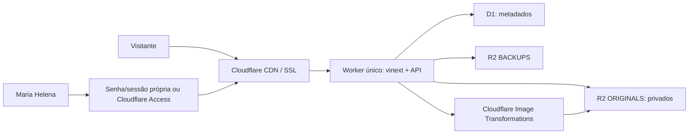

# Arquitetura

## Visão geral

O Worker é a origem do domínio. O mesmo deploy entrega HTML/React, assets,
rotas públicas, painel e API. Não existe servidor na Hostinger: a Hostinger
permanece apenas como registradora do domínio.

## Responsabilidades

- `app/`: páginas públicas e painel, mobile-first.
- `worker/api/`: contratos HTTP e regras de negócio.
- `worker/media/`: leitura privada do R2 e presets de transformação.
- `worker/utils/`: Access, validação, rate limit, auditoria e respostas.
- `migrations/`: fonte canônica do schema D1 versionado e seeds idempotentes.
- `drizzle/`: histórico legado congelado; diffs novos do Drizzle Kit são
  gerados em `.drizzle-generated/` apenas para revisão.
- `worker/scheduled.ts`: backup lógico e higiene horária.

## Dados e publicação

O D1 armazena configurações, categorias, álbuns, metadados das imagens,
intents, contatos e auditoria. Originais nunca entram no D1. Um ensaio público
precisa estar `published`, não deletado, ter capa pertencente ao álbum e pelo
menos uma imagem `ready`.

O R2 usa chaves não adivinháveis como
`originals/{albumId}/{imageId}.{ext}`. A URL pública contém apenas o `imageId` e
um preset permitido. Objetos não são sobrescritos. `/media/*` só entrega
imagem pronta de álbum publicado. O painel usa `/admin/media/*`, protegido pela
mesma autenticação do admin, para visualizar rascunhos e arquivados.

## Mídia

Presets: `thumb`, `card`, `gallery`, `hero` e `og`. A resposta prefere AVIF,
depois WebP e então JPEG. O focal point é usado quando preenchido; caso
contrário, `gravity=auto`. Cloudflare Images remove metadados públicos. A cache
de `/media/*` é longa e imutável.

## Ambientes

- local: Miniflare e bypass Access estritamente local.
- preview: recursos separados e `preview.punctumpicture.com`.
- production: `punctumpicture.com`, buckets e D1 próprios.

Os UUIDs de banco do `wrangler.jsonc` são placeholders deliberados e precisam
ser substituídos pelos IDs reais antes do deploy via Wrangler.

## Disponibilidade e custo

Não há alta disponibilidade adicional fora do edge Cloudflare. D1 e R2 são os
serviços gerenciados escolhidos para reduzir operação. Backups lógicos
complementam o Time Travel do D1; não substituem uma política de recuperação
testada.
