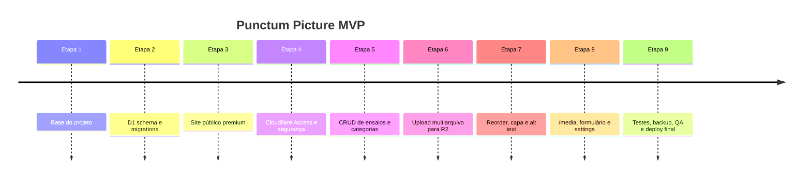

# Plano de implementação

## Estado

- Etapas 1–8: implementadas no código.
- Etapa 9: automação e documentação implementadas; QA manual com conteúdo real,
  provisionamento Cloudflare e troca de DNS permanecem operacionais.

Cada etapa está separada por módulos e migrations, permitindo revisão e rollback
de código sem misturar dados.
